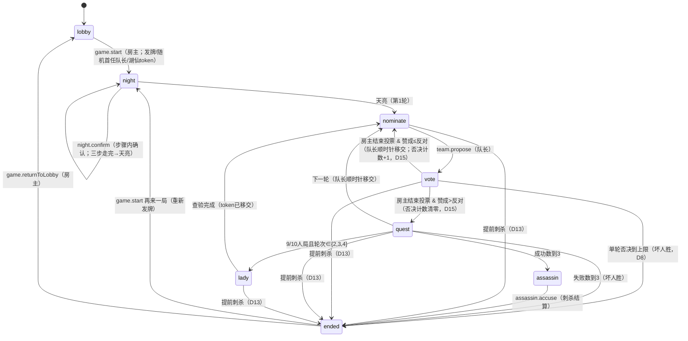

# 阿瓦隆（Avalon）游戏设计

> 状态：设计已确认（D1–D17；D7/D8/D9–D17 为终审新增）
> 游戏 ID（拟）：`avalon`
> 展示名（拟）：阿瓦隆
> 最后更新：2026-10-07
> 关联文档：[多游戏平台架构](./werewolf/docs/multigame-platform-design.md)、[房间壳契约](./werewolf/docs/room-shell-contract.md)、[你画我猜设计](./drawguess-game-design.md)（章节结构参考）

定位：与狼人杀同级的大卡片游戏（非小游戏），WerewolfGameJudge 新增游戏。
讨论位置：side chat「经典你画我猜新游戏」（2026-10-03 起转作阿瓦隆设计讨论）。
原则：用户说"开工"之前不写代码，只做设计。

## §1 目标

阿瓦隆是 WerewolfGameJudge 的第二个大卡片游戏（与狼人杀同级）：5–10 人标准身份推理，好坏两阵营轮流组队执行任务；好人先拿下 3 个任务获胜，坏人靠破坏任务、连续否决或终局刺杀梅林获胜。

本方案遵守现有平台边界：

- 服务端是游戏规则和阶段推进的唯一权威；`GameState` 是唯一权威状态，不建第二份游戏状态。
- 复用共享房间、座位、连接、重连、广播基础设施；游戏规则进入 `packages/game-engine`，Worker 负责认证、持久化与广播，客户端负责输入与展示。
- UI 级私密（D6-Q1）：`GameState` 全量广播，UI 按 `myRole` 过滤；沿用"线下熟人局默认不作弊"信任模型，不做协议级防偷看。
- 无计时（D4）：所有阶段手动推进，不需要 alarm/定时 effect；阶段推进走手动命令。
- 不修改共享房间壳与已有游戏（§10.1 禁止清单，见 §10 架构接入）。

## 已确认决策

- **D1（2026-10-03）**：全角色版——梅林、派西维尔、莫甘娜、刺客、莫德雷德、奥伯伦全部实装。
- **D2（2026-10-03）**：6张固定板子（5–10人各一张），按"不同人数角色配置表"：
  - 5人（3好2坏）：梅林、派西维尔、忠臣 ×1 vs 莫甘娜、刺客
  - 6人（4好2坏）：梅林、派西维尔、忠臣 ×2 vs 莫甘娜、刺客
  - 7人（4好3坏）：梅林、派西维尔、忠臣 ×2 vs 莫甘娜、刺客、奥伯伦
  - 8人（5好3坏）：梅林、派西维尔、忠臣 ×3 vs 莫甘娜、刺客、爪牙
  - 9人（6好3坏）：梅林、派西维尔、忠臣 ×4 vs 莫甘娜、刺客、莫德雷德
  - 10人（6好4坏）：梅林、派西维尔、忠臣 ×4 vs 莫甘娜、刺客、奥伯伦、莫德雷德
- **D3（2026-10-03）**：9人、10人局加入湖中仙女（用户决策；官方规则书建议7人+可用，中文维基写8人+，本游戏定为9/10人局）。
  - 湖中仙女是叠加职务、不是角色：任何人（包括坏人）都可能担任，不占用板子名额。
  - 机制（官方规则）：token 开局给首任队长右手边的玩家；第2、3、4轮任务结算后，持有人私下查验一名"没当过湖仙"的玩家，只能看到阵营（好/坏），然后 token 传给被查验者；共3次用完。持有人身份是公开信息；查验结果持有人可在讨论中透露/隐瞒/误导。
- **D4（2026-10-03）**：线下局，不需要计时；组队/投票/出牌全部手动推进，无超时默认规则（有人挂机线下直接喊）。
- **D5a（2026-10-03）**：刺杀环节按官方规则——第3个任务成功后自动进入；坏人讨论（线下口头）；刺客在 App 内点选座位指认（除自己外任意座位，D14），二次确认后结算。
- **D5b（2026-10-03，已确认）**：开局走**晚上流程**（用户纠正了"直接分发"方案：还是得有晚上，这样坏人可以讨论、好人角色可以想想，每人点确认推进）。
  - 对齐狼人杀夜间机制（已查仓库代码）：狼人杀晚上是按角色顺序的步骤流（NIGHT_STEPS），每个步骤只有对应角色能操作，其他人手机显示等待；狼人晚上**没有 App 内私聊**，是 meeting 机制（`canSeeEachOther: true`，各自投票、多数决，讨论全靠线下口头）；预言家这类是看私密信息+点确认；GameState 全量广播、UI 按 myRole 过滤显示；有法官语音播报。
  - 阿瓦隆晚上映射：天黑 → 坏人睁眼（meeting：坏人互见除奥伯伦，线下口头讨论；奥伯伦全程闭眼不参与、不确认，其余坏人每人点确认；无需投票决议）→ 梅林睁眼（看坏人除莫德雷德，点确认）→ 派西维尔睁眼（看梅林+莫甘娜分不清，点确认）→ 天亮，首任队长组队。顺序沿用官方 reveal 脚本。
  - 固定板子下派西维尔与莫甘娜总是同时在场，无边缘情况。法官语音（天黑请闭眼/坏人请睁眼等）实现时再定。
- **D7（2026-10-03，终审）**：组队投票模式——创建房间时可选公投/暗投，默认公投。公投：房主结束投票后同时亮票，每人投了什么全员可见（官方规则）；暗投：只公布赞成/反对数量，不揭晓个人投票。任务出牌永远是暗投，不在此选项内。
- **D8（2026-10-03，终审）**：否决上限——建房时可设置，3–5 的整数，默认 5（官方规则为 5）。单轮连续否决达到上限，坏人直接获胜。
- **D9（2026-10-07，独立评审终审）**：机器人入口对齐 drawguess 定稿——大厅房主"填充机器人"按钮，配置页无机器人开关（评审 M1，用户选 A）。
- **D10（2026-10-07，独立评审终审）**：开局门槛复用 drawguess——必须坐满所选人数（真人+机器人席位）方可开局；开始按钮未坐满时置灰并显示缺少人数；服务端拒绝文案逐字为 `'请先坐满所有座位，或填充机器人。'`，客户端禁用文案逐字为 `'座位尚未坐满'`（复用 drawguess/故事接龙，SKILL.md 3c）；"还差 X 人"为本文档增强（有意，评审 M2）。
- **D11（2026-10-07）**：刺杀阶段不亮牌——沿用晚上互认状态，不新增坏人身份展示（奥伯伦仍互不可见）；刺客点选座位指认+二次确认（独立评审 m10，用户选 A）。
- **D12（2026-10-07，终审）**：不做任何关于 bot 接管的提示——接管机制保留（房主用现有入口自行接管），bot 席位待操作时仅显示等待状态，不弹"请房主接管…"类提示。（注：此为对 SKILL.md 3c 默认"受控席位 banner/hint"模式的有意偏离，用户已拍板。）
- **D13（2026-10-07，终审）**：提前刺杀——固定规则（非可配项）。`night` 结束后、游戏结束前任意时刻，刺客可通过常驻刺杀按钮发起提前刺杀（坏人线下口头讨论，D6-Q6；App 内无讨论界面，刺客点选即执行）；点选座位 + `AlertModal` 二次确认；刺中梅林 → 坏人直接获胜，刺错 → 好人直接获胜，游戏立即结束。官方规则无此机制（官方仅 3 成功后刺杀），为本产品自定义规则。
- **D14（2026-10-07，终审）**：刺杀不限制目标阵营——刺客可指认除自己外的任意座位；指认到梅林 → 坏人胜，指认到其他人（含坏人/奥伯伦）→ 好人胜。服务端不再以"目标非好人"拒绝，避免拒绝机制向刺客泄漏奥伯伦身份（m10/D11）。官方"指认一名好人"为意图描述，刺错即好人胜。
- **D15（2026-10-07，终审）**：组队投票对齐狼人杀——可改票（重投覆盖）；不自动结算，房主在房主管理中点"结束投票"后结算；结束时未投票视为弃权，赞成>反对则通过，否则否决（含平票）。任务出牌也可改牌（收齐前重出覆盖，结算仍在收齐后自动进行）。
- **D16（2026-10-07，终审）**：任务阶段加房主手动结束——收齐自动洗混结算保持不变；房主可在房主管理中点"结束任务"提前结算（D4 无计时，处理挂机队员）；结束时未出牌视为成功（好人本就只能出成功，坏人未出牌视为放弃出失败）。
- **D17（2026-10-07，终审）**：投票与任务出牌不用按钮，改用两张大卡片（参考阿瓦隆实物卡牌：投票卡浅色赞成/深色反对，任务卡金色圣杯成功/深色圣杯失败）；点选/改选交互对齐 D15 改票/改牌。

## D6 架构对接决策（2026-10-03 仓库调研已完成，全部已确认）

- D6-Q1（2026-10-03，已确认）：私密信息安全级别——A. 接受 UI 级私密（现有 trust model：公开广播+UI 按 myRole 过滤，抓包可见，零新增）
- D6-Q2（2026-10-03，已确认）：板子选择 UI——A. 人数即板子（5–10人各一张，房主只定人数，无选择页）
- D6-Q3（2026-10-03，已确认）：机器人——要，测试用（隐式占位 + 仅房主代打，沿用现有机制，不做 AI）
- D6-Q4（2026-10-03，已确认）：玩法说明屏——要（规则、角色、板子说明）
- D6-Q5（2026-10-03，已确认）：胜负与成长体系——接入 growth/XP 结算（与狼人杀同级）
- D6-Q6（2026-10-03，已确认）：刺杀讨论环节——线下口头就够，App 内不做私聊/讨论支持；刺客直接点选指认+二次确认

调研结论速览：新增游戏是垂直切片注册（`GAME_TYPES` + engine catalog + worker catalog + client catalog + 三处模块目录，8 处新代码，不碰共享房间壳）；大卡片靠 `GameHomeTier='main'`（目前只有 werewolf 是 main）；板子复用 `roles: RoleId[]` 固定列表模式、人数由长度派生；座位内核/房间命令/警长选举 phase+ballots+手动推进模式可复用；队长轮换/投票结算（过半数/平票否决/否决计数器，上限 D8 可配）/秘密出牌/刺杀终局/winner 结算需新写；湖仙查验复用预言家 `RevealKind` factionCheck 模式；contract test 要求新游戏目录与 GAME_TYPES 穷尽对应、禁普通 `as`、样式走 design tokens。

## 官方规则依据（2026-10-03 已查证，来源：Indie Boards & Cards 官方规则书 PDF）

- 梅林和刺客是**每局必备、锁定**；派西维尔、莫甘娜、莫德雷德、奥伯伦四个**可选、可任意组合**。官方没有"按人数解锁特殊角色"的说法。
- 唯一硬性搭配规则：**5人局如果上派西维尔，必须同时上莫甘娜或莫德雷德**（原文 "For games of 5, be sure to add either Mordred or Morgana when playing with Percival"）。
- 好坏人数：5人3好2坏 / 6人4好2坏 / 7人4好3坏 / 8人5好3坏 / 9人6好3坏 / 10人6好4坏。
- 任务人数：5人 2-3-2-3-3；6人 2-3-4-3-4；7人 2-3-3-4-4；8人 3-4-4-5-5；9人 3-4-4-5-5；10人 3-4-4-5-5。7人及以上的第4轮需要2张失败票才算失败。
- 投票：多数通过，**平票算否决**；**单轮连续5次否决，坏人直接获胜**（官方值；D8：本游戏建房时可设为 3–5，默认 5）。
- 任务牌：好人必须出成功牌，坏人可出成功或失败；洗混后亮牌，一张失败即任务失败（第4轮7人+需两张）。
- 刺杀：好人拿下3个任务后，坏人讨论、**由刺客指认**为梅林（除自己外任意座位，D14）；指认正确坏人翻盘，否则好人获胜。
- 奥伯伦不是"莫德雷德的爪牙"，开局互认环节不睁眼、也不知道其他坏人。
- 阵营强度（官方标注）：加派西维尔→好人变强；加莫德雷德→坏人变强；加奥伯伦→好人变强；加莫甘娜→坏人变强。

## 固定板子（2026-10-03 已查证，用户已确认）

来源：中文维基百科"抵抗组织"词条、中文《阿瓦隆》完整规则手册，均有"不同人数角色配置表"。
此前"开局开关+任意组合"方案作废——那是英文规则书的原则性文字，漏了这张实际在用的固定表。

5–10人各一张固定板子（忠臣=亚瑟的忠臣，爪牙=莫德雷德的爪牙）：

- 5人（3好2坏）：梅林、派西维尔、忠臣 ×1 vs 莫甘娜、刺客
- 6人（4好2坏）：梅林、派西维尔、忠臣 ×2 vs 莫甘娜、刺客
- 7人（4好3坏）：梅林、派西维尔、忠臣 ×2 vs 莫甘娜、刺客、奥伯伦
- 8人（5好3坏）：梅林、派西维尔、忠臣 ×3 vs 莫甘娜、刺客、爪牙
- 9人（6好3坏）：梅林、派西维尔、忠臣 ×4 vs 莫甘娜、刺客、莫德雷德
- 10人（6好4坏）：梅林、派西维尔、忠臣 ×4 vs 莫甘娜、刺客、奥伯伦、莫德雷德

平衡逻辑（与官方强度标注一致）：7人局坏人刚到3个，先上奥伯伦（弱坏人，不互认）；8人局上普通爪牙；9人局好人6个了才上莫德雷德（强坏人，梅林看不见）。10人局六特殊全上，正好呼应 D1 全角色版。
5人局带派西维尔配莫甘娜，符合官方"5人局上派西维尔必须加莫甘娜或莫德雷德"。
产品形态：复用狼人杀现有"板子"概念，阿瓦隆即 6 张固定板子。

## §2 核心玩法流程

### §2.1 开局与晚上

```text
大厅坐满所选人数（真人+机器人席位；人数即板子，D6-Q2；D10 复用 drawguess 规则：开始按钮未坐满时置灰并显示缺少人数）
→ 房主开始游戏：服务端按人数取固定板子、洗牌发牌、随机首任队长（官方规则）；
  9/10人局：湖仙 token 给首任队长右手边的玩家
→ night.evilReveal（天黑）：坏人睁眼（除奥伯伦）——看到队友，线下口头讨论，每人点确认
→ night.merlinReveal：梅林睁眼——看到坏人（除莫德雷德），点确认
→ night.percivalReveal：派西维尔睁眼——看到梅林+莫甘娜（分不清谁是谁），点确认
→ 天亮：首任队长开始第 1 轮组队
```

- 顺序沿用官方 reveal 脚本；对齐狼人杀夜间机制（步骤流 + meeting 互见 + 点确认推进，见 D5b）。
- 非当前步骤角色的手机显示"天黑等待"。
- 奥伯伦在 `evilReveal` 看到"无人可认"提示（他不认识其他坏人、其他坏人也不认识他），点确认即可。
- 固定板子下派西维尔与莫甘娜总是同时在场，无边缘情况。

### §2.2 任务轮循环（共 5 轮）

```text
nominate：第 R 轮队长从全部已入座席位中选出 N(R) 名队员（可含自己；N(R) 见任务人数表）
→ 讨论（线下口头，不限时，D4）
→ vote：全员投票赞成/反对（可改票，重投覆盖）；房主在房主管理中点"结束投票"后按投票模式结算（D7：公投同时亮票，暗投只公布数量；D15）
    → 赞成票 > 反对票：通过（未投票视为弃权）；否决计数清零，进 quest（D15）
    → 否则（含平票）：否决；否决计数+1；队长顺时针移交，重新 nominate（D15）；
      若否决计数到上限（D8，默认 5）：坏人直接获胜，终局
→ quest：队员秘密出牌（好人只能出成功，坏人可出成功/失败）；收齐后洗混亮牌
    → 失败牌 ≥1 张（7人及以上第4轮需 ≥2 张）：任务失败
    → 否则：任务成功
→ 结算：成功数/失败数更新
    → 成功数到 3：进刺杀环节（§2.4）
    → 失败数到 3：坏人获胜，终局
    → 否则：9/10人局且 R∈{2,3,4} → 湖仙查验（§2.3）；
             否则队长顺时针移交，进第 R+1 轮 nominate
```

任务人数表（官方规则，见"官方规则依据"区）：

| 人数 | Q1  | Q2  | Q3  | Q4  | Q5  |
| ---- | --- | --- | --- | --- | --- |
| 5    | 2   | 3   | 2   | 3   | 3   |
| 6    | 2   | 3   | 4   | 3   | 4   |
| 7    | 2   | 3   | 3   | 4\* | 4   |
| 8    | 3   | 4   | 4   | 5\* | 5   |
| 9    | 3   | 4   | 4   | 5\* | 5   |
| 10   | 3   | 4   | 4   | 5\* | 5   |

（`*`：第4轮需 2 张失败票才算失败；仅 7 人及以上。）

- 投票资格为全部已入座席位（含机器人席位，由房主代投，见 §8）；可改票（重投覆盖）；房主在房主管理中点"结束投票"后结算，未投票视为弃权（D15；D4 无计时，线下催促）。
- 组队投票模式（D7，建房时选，默认公投）：**公投**——房主结束投票后同时亮票，每人投了什么全员可见（官方规则）；**暗投**——只公布赞成/反对数量，不揭晓个人投票。
- 出牌是秘密的**（暗投/匿名）**：收齐前不揭晓个人选择；结算时只公布成功/失败**数量**（洗混亮牌），不公布谁出了什么（官方规则）。
- 好人出失败牌服务端直接拒绝（官方"好人必须出成功牌"）。

### §2.3 湖中仙女（9/10人局，第2/3/4轮任务结算后）

```text
lady：持有人点选一名"没当过湖仙"的玩家（不能选自己）
→ 被查验者手机弹出确认 → 点确认后，持有人私密看到其阵营（好/坏）
→ token 移交给被查验者 → 回到 nominate（下一轮）
```

- 共 3 次用完；持有人身份是公开信息；查验结果持有人可在讨论中透露/隐瞒/误导（官方规则，见 D3）。
- 8人及以下局无此阶段。

### §2.4 终局与刺杀

- 3 个任务成功 → `assassin` 阶段：坏人讨论（线下口头，D6-Q6）；不新增坏人亮牌，沿用晚上互认状态（D11，奥伯伦仍互不可见）；刺客在 App 内点选座位指认一人为梅林，`AlertModal` 二次确认（仓库长期规矩：确认框用 AlertModal，不用 Alert.alert）；指认正确 → 坏人获胜；错误 → 好人获胜（官方规则）。
- 提前刺杀（D13，固定规则）：`night` 结束后、游戏结束前任意时刻（`nominate` / `vote` / `quest` / `lady`），刺客可通过常驻刺杀按钮发起（坏人线下口头讨论，D6-Q6；App 内无讨论界面，刺客点选即执行）；点选座位 + `AlertModal` 二次确认；刺中梅林 → 坏人直接获胜，刺错 → 好人直接获胜，游戏立即结束。
- 3 个任务失败 → 坏人获胜，终局。
- 单轮连续投票否决到上限 → 坏人获胜，终局（D8，默认 5；官方规则为 5）。
- 终局：公布 winner + 获胜原因 + 全员身份揭晓，接入 growth/XP 结算（D6-Q5；XP 数值为狼人杀的三分之二：`xpEarned=33`（狼人杀 `XP_BASE=50`），2026-10-07 用户确认）。
- 再来一局：比分/轮次/否决计数/湖仙 token（含 examinedSeats）/ballots/plays 清零并重新发牌，首任队长重随；房间配置（人数/投票模式/否决上限）保留。

## §3 房间设置

配置页使用共享设置控件（`GameSettings`/`GameScreen`，见房间壳契约），只有大厅阶段可以修改。

| 设置     | 默认值 | V1 可选值                                            |
| -------- | ------ | ---------------------------------------------------- |
| 玩家人数 | 6      | 5–10 的整数（人数即板子，无选择页，D6-Q2）           |
| 投票模式 | 公投   | 公投 / 暗投（仅组队投票；任务出牌永远是暗投，D7）    |
| 否决上限 | 5      | 3–5 的整数（单轮连续否决到上限坏人胜；官方为 5，D8） |

- 配置页只读展示当前人数对应的板子角色构成（6 张固定板子，见"固定板子"区）。
- 人数变化 → 板子自动对应（板子由人数唯一确定）。
- 游戏开始后锁定座位与配置。
- 开局人数门槛（D10，复用 drawguess）：必须坐满所选人数的座位（真人+机器人席位）方可开局；开始按钮未坐满时置灰并显示缺少人数。

## §4 状态机

### §4.1 Phase 联合类型（草案）

```ts
type AvalonPhase =
  | { readonly kind: 'lobby' }
  | {
      readonly kind: 'night';
      readonly step: 'evilReveal' | 'merlinReveal' | 'percivalReveal';
      readonly confirmedSeats: readonly number[];
    }
  | {
      readonly kind: 'nominate';
      readonly round: 1 | 2 | 3 | 4 | 5;
      readonly leaderSeat: number;
      readonly requiredSize: number;
      readonly proposedSeats: readonly number[] | null;
    }
  | {
      readonly kind: 'vote';
      readonly round: 1 | 2 | 3 | 4 | 5;
      readonly leaderSeat: number;
      readonly proposedSeats: readonly number[];
      readonly ballots: Readonly<Record<number, 'approve' | 'reject'>>; // seat -> 票
      readonly rejectStreak: number; // 本轮已否决次数
    }
  | {
      readonly kind: 'quest';
      readonly round: 1 | 2 | 3 | 4 | 5;
      readonly teamSeats: readonly number[];
      readonly plays: Readonly<Record<number, 'success' | 'fail'>>; // 结算前不向他人揭晓个人选择
    }
  | {
      readonly kind: 'lady';
      readonly afterRound: 2 | 3 | 4;
      readonly holderSeat: number;
      readonly examinedSeats: readonly number[]; // 当过湖仙的 seat，不可再被查验
      readonly targetSeat: number | null; // 不含 holderSeat 本人
      readonly acknowledged: boolean;
    }
  | { readonly kind: 'assassin'; readonly accusedSeat: number | null }
  | {
      readonly kind: 'ended';
      readonly winner: 'good' | 'evil';
      readonly reason:
        | 'threeSuccess' // 3成功→刺杀未命中，好人胜
        | 'threeFail' // 3失败，坏人胜
        | 'vetoLimitReached' // 单轮否决到上限（D8），坏人胜
        | 'assassinationHit' // 刺杀命中（3成功后），坏人胜
        | 'assassinationMiss' // 刺杀未命中（3成功后），好人胜
        | 'earlyAssassinationHit' // 提前刺杀命中（D13），坏人胜
        | 'earlyAssassinationMiss'; // 提前刺杀未命中（D13），好人胜
      readonly assassinAccusedSeat?: number;
    };
```

**night 各步骤参与者集合**：`evilReveal` = 全部坏人席位（含奥伯伦，看到"无人可认"）；`merlinReveal` = 梅林席位；`percivalReveal` = 派西维尔席位。`confirmedSeats` 只收参与者集合内的确认；非参与者发送 `night.confirm` 拒绝并中文提示。

### §4.2 关键 transition



平台 lifecycle 映射：

| Avalon phase                                                  | Platform lifecycle |
| ------------------------------------------------------------- | ------------------ |
| `lobby`                                                       | `setup`            |
| `night` / `nominate` / `vote` / `quest` / `lady` / `assassin` | `ongoing`          |
| `ended`                                                       | `ended`            |

### §4.3 复用点与新写点

复用（已验证存在）：

- `GameStatus` 生命周期派生（`getLifecycle`，见 §10.1 清单）。
- seating kernel（`platform/room/seating/kernel.ts`）与平台房间命令（`room.seat.take/leave/kick/clear/fillBots`）。
- 警长选举的"phase 联合类型 + `ballots` + 手动推进"模式（`sheriffElectionHandler.ts`；注意警长选举是最高票胜，阿瓦隆投票结算需单独写过半数/平票否决）。
- 狼人 `meeting.canSeeEachOther` 模式（`night.evilReveal` 坏人互见）。
- 预言家 `RevealKind` + `buildRevealPayload` + `revealExecutor` 模式（`lady` 查验只看阵营 = `factionCheck`）。
- `useRoomBotControl` / `canTakeOverBots` / `controlledSeat` 接管机制（§8）。

新写：

- 上述 phase 联合类型与全部 transition handler（队长轮换、投票结算、否决计数器（上限 D8 可配）、秘密出牌与洗混结算、lady token 流转、assassin 指认、winner 结算）。
- 可见集合计算纯函数（开局发牌时算好 `nightInfo`）。
- winner 结算事件（参考 undercover `getUndercoverWinner` 模式）与 growth settlement effect 接入。

## §5 权威数据模型

设计形状，最终实现名称以 engine 中的领域类型为准。

```ts
type AvalonRoleId =
  | 'merlin'
  | 'percival'
  | 'loyalServant' // 好人
  | 'morgana'
  | 'assassin'
  | 'mordred'
  | 'oberon'
  | 'minion'; // 坏人

interface AvalonConfig {
  readonly numberOfPlayers: 5 | 6 | 7 | 8 | 9 | 10; // 人数即板子
  readonly voteMode: 'public' | 'secret'; // D7：组队投票模式，默认 'public'；仅组队投票，任务出牌永远是暗投
  readonly vetoLimit: 3 | 4 | 5; // D8：单轮连续否决上限，默认 5（官方为 5）
}
// 注：机器人无配置项（D9）：大厅房主"填充机器人"按钮，按座位状态判定隐式 bot，不进房间配置。

// 固定板子：人数 → 角色列表（人数由 roles.length 派生，复用狼人杀 PresetTemplate 模式；
// 板子内容见本文"固定板子"区，D2 已确认）
const AVALON_BOARDS: Record<5 | 6 | 7 | 8 | 9 | 10, readonly AvalonRoleId[]> = {
  /* 5: [merlin, percival, loyalServant, morgana, assassin], ... */
};

// 任务人数表（官方规则）
const QUEST_SIZES: Record<
  5 | 6 | 7 | 8 | 9 | 10,
  readonly [number, number, number, number, number]
> = {
  5: [2, 3, 2, 3, 3],
  6: [2, 3, 4, 3, 4],
  7: [2, 3, 3, 4, 4],
  8: [3, 4, 4, 5, 5],
  9: [3, 4, 4, 5, 5],
  10: [3, 4, 4, 5, 5],
};
const FOURTH_QUEST_DOUBLE_FAIL_MIN_PLAYERS = 7; // 7人及以上第4轮需2张失败票

interface AvalonNightInfo {
  readonly evilPeers: Readonly<Record<number, readonly number[]>>; // seat -> 互认的坏人 seats（奥伯伦对应空数组）
  readonly merlinSees: readonly number[]; // 梅林看到的坏人 seats（不含莫德雷德）
  readonly percivalSees: readonly number[]; // 派西维尔看到的梅林+莫甘娜 seats
}

interface AvalonState {
  readonly stateVersion: number;
  readonly roomCode: string;
  readonly hostUserId: string;
  readonly realSeats: Readonly<Record<number, SeatOccupant | undefined>>; // 共享座位状态
  readonly config: AvalonConfig;
  readonly phase: AvalonPhase;
  readonly phaseRevision: number; // 单调递增
  readonly roles: Readonly<Record<number, AvalonRoleId>>; // seat -> 角色；公开广播，UI 按 myRole 过滤（D6-Q1）
  readonly nightInfo: AvalonNightInfo; // 发牌时服务端算好；同上，UI 级私密
  readonly leaderSeat: number;
  readonly questResults: ReadonlyArray<'success' | 'fail'>;
  readonly ladyHolderSeat: number | null; // 9/10人局才有
  readonly xpSettled: boolean; // winner 结算幂等标记
}
```

Codec 必须用 `z.strictObject` 精确验证，不变量示例：`roles` 覆盖全部已入座 seat 且角色构成与人数板子一致；`plays` 只含队员 seat；`ballots` 只含已入座 seat；`lady.targetSeat` 不在 `examinedSeats` 中。损坏状态直接失败，不猜测修复。

`AvalonState` 不保存：可推导的第二份可见集合、客户端本地选择态、未提交的投票/出牌输入。

## §6 命令与权限

### §6.1 Public commands

| 命令                          | 发送方                                                                                                                    | 阶段                                                             | 说明                                                                                                                                 | 失败文案（中文，走 AlertModal）                                                                          |
| ----------------------------- | ------------------------------------------------------------------------------------------------------------------------- | ---------------------------------------------------------------- | ------------------------------------------------------------------------------------------------------------------------------------ | -------------------------------------------------------------------------------------------------------- |
| `avalon.game.start`           | 房主                                                                                                                      | `lobby` / `ended`                                                | 发牌、随机首任队长、进 `night`；`ended` 时为再来一局（重新发牌）                                                                     | 非房主："只有房主可以开始游戏"；座位未坐满："请先坐满所有座位，或填充机器人。"                           |
| `avalon.night.confirm`        | 当前 night 步骤参与者集合内的 seat（evilReveal=全部坏人含奥伯伦；merlinReveal=梅林；percivalReveal=派西维尔），或其接管人 | `night`                                                          | 确认已查看信息；参与者全部确认后推进；非参与者发送拒绝并中文提示                                                                     | 非参与者："你不在当前确认步骤内"                                                                         |
| `avalon.team.propose`         | 队长（或其接管人）                                                                                                        | `nominate`                                                       | 提交 `requiredSize` 名队员（可含自己）                                                                                               | 非队长："只有当前队长可以组队"；人数不对："队员人数必须为 X 人"                                          |
| `avalon.team.vote`            | 全部已入座 seat（机器人席位由房主代投）                                                                                   | `vote`                                                           | 赞成/反对，可改票（重投覆盖，D15）；房主手动"结束投票"后 engine 结算                                                                 | 阶段非法："当前不在投票阶段"                                                                             |
| `avalon.vote.finish`          | 房主                                                                                                                      | `vote`                                                           | 房主手动结束投票并结算（D15）：未投票视为弃权                                                                                        | 非房主："只有房主可以结束投票"                                                                           |
| `avalon.quest.play`           | 队员（机器人席位由房主代打）                                                                                              | `quest`                                                          | 出成功/失败，收齐前可改牌（重出覆盖，D15）；好人出失败被拒绝；收齐后洗混结算                                                         | 非队员："你不在本轮任务队伍中"；好人出失败："好人只能出成功牌"                                           |
| `avalon.quest.finish`         | 房主                                                                                                                      | `quest`                                                          | 房主手动结束任务并提前结算（D16）：未出牌视为成功                                                                                    | 非房主："只有房主可以结束任务"                                                                           |
| `avalon.lady.check`           | 湖仙持有人                                                                                                                | `lady`                                                           | 选定一名未当过湖仙的玩家                                                                                                             | 非持有人："只有湖仙持有人可以查验"；目标当过湖仙："该玩家已担任过湖仙，不能查验"；选自己："不能查验自己" |
| `avalon.lady.acknowledge`     | 被查验者                                                                                                                  | `lady`                                                           | 确认展示阵营；持有人看到结果，token 移交                                                                                             | 非被查验者："只有被查验者可以确认"                                                                       |
| `avalon.assassin.accuse`      | 刺客（或其接管人）                                                                                                        | `assassin`                                                       | 指认一名玩家为梅林（除自己外任意座位，D14；客户端 `AlertModal` 二次确认）                                                            | 非刺客："只有刺客可以指认"；指认自己："不能指认自己"                                                     |
| `avalon.assassin.earlyStrike` | 刺客（或其接管人）                                                                                                        | `nominate` / `vote` / `quest` / `lady`（`night` 结束后任意阶段） | 提前刺杀（D13）：指认一名玩家为梅林（除自己外任意座位，D14；客户端 `AlertModal` 二次确认）；命中→坏人胜，未命中→好人胜，游戏立即结束 | 非刺客："只有刺客可以刺杀"；`night` 阶段："晚上阶段不能刺杀"；刺杀自己："不能刺杀自己"                   |
| `avalon.game.returnToLobby`   | 房主                                                                                                                      | `ended`                                                          | 返回大厅                                                                                                                             | 非房主："只有房主可以返回大厅"                                                                           |

共享入座、离座、踢人、补机器人（`room.seat.fillBots`）继续使用平台命令，不复制 Avalon 版本。

### §6.2 权限矩阵

| 操作                                                                            | 权限                                                                            |
| ------------------------------------------------------------------------------- | ------------------------------------------------------------------------------- |
| 开始游戏、再来一局、返回大厅                                                    | 房主（`state.hostUserId` 对比），且阶段合法                                     |
| 组队提案                                                                        | 当前 `leaderSeat` 对应的已入座用户；机器人席位仅房主可接管代打                  |
| 投票                                                                            | 全部已入座 seat，每 seat 一票，可改票（D15）；机器人席位仅房主可接管代投        |
| 结束投票                                                                        | 房主（房主管理，D15）                                                           |
| 结束任务                                                                        | 房主（房主管理，D16）                                                           |
| 出牌                                                                            | `teamSeats` 成员；机器人席位仅房主可接管代打                                    |
| 湖仙查验 / 确认展示                                                             | 持有人 / 被查验者本人                                                           |
| 刺杀指认（含提前刺杀 D13）                                                      | 刺客 seat 对应用户；机器人席位仅房主可接管代指认；提前刺杀仅 `night` 结束后可用 |
| 查看他人私密信息（`roles` 明细、`nightInfo`、未亮票的 `ballots`、他人 `plays`） | 无（UI 按 `myRole` 过滤；D6-Q1）                                                |

权限模型沿用平台 §14：HTTP middleware 认证身份，engine 授权游戏命令；`controlledSeat` 仅当游戏允许 bot control、调用者是房主、目标确实是 bot 时接受；接管真人 seat 直接失败。

**Visibility**（UI 级私密，D6-Q1）：

- `roles` / `nightInfo`：全量广播，客户端按 `myRole` 裁剪——坏人只看到 `evilPeers[mySeat]`，梅林只看到 `merlinSees`，派西维尔只看到 `percivalSees`，其他人看不到任何他人信息。
- `vote.ballots`：收齐前他人不可见；公投模式亮票后全员可见（官方同时亮票），暗投模式只公布赞成/反对数量（D7）。
- `quest.plays`：个人选择永不向他人揭晓；结算只公布成功/失败数量。
- `lady` 查验结果：只对持有人可见。
- `assassin` 指认（含提前刺杀）：除自己外任意座位可点选（D14）；提前刺杀按钮仅刺客端可见（D6-Q1）。

## §7 客户端体验

- 首页：大卡片（`tier: 'main'`，与狼人杀并列），展示名"阿瓦隆"（`GameHomeContribution`，参考 `src/games/werewolf/home/`）。
- 配置页：人数 stepper（5–10）+ 投票模式（公投/暗投）+ 否决上限（3–5）+ 当前板子角色构成只读展示；沿用共享 `GameSettings` 控件，不自建样式。
- 大厅：开始按钮在未坐满所选人数时置灰，禁用文案逐字为"座位尚未坐满"（可附加"还差 X 人"）；服务端拒单文案逐字为"请先坐满所有座位，或填充机器人。"（D10）。
- 玩法说明屏（D6-Q4）：目标、基本流程、队长/队员/投票规则、角色说明、板子表、湖仙与刺杀说明；放在 guide 入口（房间壳"玩法"动作）。
- 房间：`RoomShell` 全阶段用 `seats` 内容变体（对齐狼人杀；2026-10-07 用户要求"全部"对齐后重构，不再用 `workspace`）；座位盘全程可见，各阶段 UI 在 `beforeSeatBoard`/`afterSeatBoard`；未设置名字的玩家显示为"匿名玩家"（仓库统一规矩，对齐其他游戏）。
- 板子信息卡（2026-10-07 对齐狼人杀 `BoardInfoCard`）：大厅 + 局内 `beforeSeatBoard` 显示本局角色配置（好人/坏人分组 chip），可折叠（局内默认折叠）；点角色 chip 弹窗看技能介绍；数据复用 engine `AVALON_BOARDS`（服务端唯一权威，客户端不双写）。
- 查看身份（2026-10-07 对齐狼人杀 `RoleCardModal`）：局内底部常驻"查看身份"按钮，弹窗显示自己的角色名/阵营/技能介绍（`AlertModal` message 走法；展示名复用 `avalonRoleDisplay.ts`，与结算页统一为"忠臣/爪牙"）。
- `night`（2026-10-07 改为狼人杀丘比特两步流程，用户原话"应该有个确认信息按钮，点击了才弹窗"）：座位盘保持可见；底部"确认信息"按钮（仅需确认的指令出现：坏人互认/梅林/派西维尔）；点击后 `AlertModal` 弹窗显示私密信息，弹窗内"确认信息"提交 `avalon.night.confirm`；音频播放时座位 `visuallyDisabled`（`state.isAudioPlaying`）。第一晚播报（见"第一晚播报"节）：房主设备按序播放，未播完时确认被服务端门控阻塞。
- `nominate`：队长点选座位（多选，数量必须 = `requiredSize`）后提交；非队长显示"等待队长组队（X 号座位）"。
- `vote`（对齐狼人杀，D15；大卡片 UI，D17）：赞成/反对两张大卡片（参考实物投票卡：浅色赞成/深色反对），点选投票，可改选（点另一张切换）；显示"已投票，等待他人"；不自动结算——房主在房主管理中点"结束投票"后结算（D4 无计时，线下催促；结束时未投票视为弃权）；公投模式同时亮票（每人投了什么公开），暗投模式只公布赞成/反对数量；赞成>反对通过，否则否决（含平票）。结算面板（全员可见）：结论横幅（组队通过 / 组队被否决·第 N 次）+ 公投列出每人投票（座位号·名字·赞成/反对/弃权）/ 暗投仅汇总数量（赞成 X · 反对 Y · 弃权 Z）；展示后自动进下一阶段。
- `quest`（大卡片 UI，D17）：队员看到"秘密出牌"：两张大卡片（参考实物任务卡：金色圣杯成功/深色圣杯失败）——好人只看到"成功"一张，坏人看到"成功/失败"两张；出完显示"已出牌"，结算前可改牌（重出覆盖，D15）；收齐自动洗混结算，房主也可在房主管理中"结束任务"提前结算（未出牌视为成功，D16）；洗混亮牌动画（任务卡逐张翻开：成功=金色圣杯卡，失败=深色圣杯卡），汇总成功 X · 失败 Y + 任务成功/失败结论；不揭晓出牌人；展示后自动进下一阶段。
- `lady`：持有人点选查验目标（当过湖仙的置灰不可选）；被查验者弹出确认框；持有人看到阵营结果（好/坏）。
- 提前刺杀按钮（D13）：`night` 结束后、游戏结束前，刺客端常驻"刺杀"按钮（仅刺客可见；`assassin` 阶段隐藏，该阶段已有指认界面）；发起前坏人线下口头讨论（D6-Q6），App 内无讨论界面；点击进入选座模式 → 点选座位（除自己外任意座位，D14） → `AlertModal` 二次确认"确定提前刺杀【X】？刺错则好人直接获胜" → 服务端即时结算，全员跳终局（未接管 bot 不做任何提示，D12）。
- `assassin`（D11：不亮牌，沿用晚上互认状态）：
  - 好人端：全屏等待"坏人正在商量刺杀目标…"，无操作。
  - 坏人端（非刺客）：提示"坏人商量时间（线下口头）"，座位只读 + "等待刺客指认"。
  - 刺客端：点选座位（除自己外任意座位；指认到坏人/奥伯伦也算刺错，好人胜，D14） → `AlertModal` 二次确认"确定指认【X】为梅林？" → 确认后服务端结算，取消则返回重选。
  - 刺客席位为未接管 bot：该阶段等待，不做任何接管提示（D12；D4 无计时，房主可用现有入口自行接管）。
- `ended`：胜负横幅 + 获胜原因 + 全员身份揭晓 + XP 结算展示；房主可见"再来一局"/"返回大厅"。
- 历史记录：房间设"记录"入口（对齐玩法说明屏的房间壳动作位），按轮次展示：队长、队员名单、投票结果、任务结果（成功/失败数量）；公投模式展示个人投票，暗投模式仅数量；任务出牌人不揭晓；数据来自 state 按轮次聚合。
- 样式：全部走 `@/theme` design tokens；确认框一律 `AlertModal`（禁 `Alert.alert`）；中文文案。
- 房间壳验收按 `room-shell-contract.md` 的 New-Game Acceptance Checklist 逐项记录（config/lobby/各阶段/overlays/恢复/布局）。

## 第一晚播报（2026-10-07 用户确认，对齐狼人杀）

- 生成方法与狼人杀一模一样：Microsoft Edge TTS（`zh-CN-YunjianNeural`，pitch `-20Hz`，rate `-20%`，volume `+100%`，ffmpeg `+10dB`；`night` 5 秒尾部静音）。脚本：`scripts/generate_audio_edge_tts.py --game avalon`，输出到 `assets/audio_avalon/`（begin）与 `assets/audio_avalon_end/`（end）。
- 8 段定稿文案（去手势，App 直接显示信息）：
  1. 天黑请闭眼。
  2. 除奥伯伦外，坏人请睁眼，请互相确认身份。
  3. 坏人请闭眼。
  4. 梅林请睁眼，请确认坏人身份。
  5. 梅林请闭眼。
  6. 派西维尔请睁眼，请记住梅林和莫甘娜。
  7. 派西维尔请闭眼。
  8. 天亮了。
- 服务端权威队列（事件溯源）：`avalon.game.started` 与 `evilReveal` 同一事件，一次排 `[night, evil_reveal]`；每步转场排 `[上一步 end, 下一步 begin]`；`percivalReveal` 完成后排 `[percival_reveal end, night_end]`。
- 门控：`isAudioPlaying=true` 时 `avalon.night.confirm` 与 `avalon.game.returnToLobby` 被服务端拒绝（"播报尚未结束，请稍候"）；房主播完提交 `avalon.audio.ack`（仅房主）清空队列、释放门控。
- 客户端：`avalonAudioRegistry.ts`（key→mp3 严格映射，缺失 fail-fast）+ `AvalonAudioPlayer` + `useAvalonAudioOrchestration`（房主按序播放，单段失败跳过，播完 ack；开局预加载 8 段）。配置页 `audioPreview` 试听"天黑请闭眼"。

## §8 机器人机制

> D6-Q3：要，测试用（隐式占位 + 仅房主代打，沿用现有机制，不做 AI）。D9（M1）：入口对齐 drawguess 定稿——大厅房主"填充机器人"按钮，配置页无开关。

- 隐式机器人席位（`isAvalonImplicitBotSeat`，与 drawguess 同构判定）：房主在大厅点了"填充机器人"、座位在人数范围内、无真人入座、没被踢过；显示名"机器人X号"。
- 接管：仅房主可接管（三层校验 `useRoomBotControl` → `canTakeOverBots: isHost` → engine `resolveEffectiveSeatActor`，非房主 `REASON_NOT_HOST`、目标非 bot `REASON_CONTROLLED_SEAT_NOT_BOT` 拒绝）；局内房主点机器人座位直接接管/释放（对齐狼人杀，不做任何接管提示 UI，D12；2026-10-07 用户确认）；接管后房主以该席位代打（`controlledSeat`）。
- 机器人无自主行动：晚上确认、组队、投票、出牌、湖仙查验、刺杀指认，全部需房主接管代操作；未接管则该步骤等待（D4 无计时，线下催促）。
- 强推理游戏，bot 仅用于测试流程与凑人数，不做 AI 决策（非目标）。
- 房主可踢掉单个机器人席位（走共享 `room.seat.kick` 平台命令，不自创按钮）；座位清空时机器人占位同步清理（对齐 drawguess §10）。

## §9 断线与异常

| 场景                     | 权威行为                                                                                                                                       | 客户端反馈                                                      |
| ------------------------ | ---------------------------------------------------------------------------------------------------------------------------------------------- | --------------------------------------------------------------- |
| 夜间/投票/出牌中有人断线 | 座位与阶段保留，等待其操作（D4 无计时）；其已确认/已投票/已出牌记录保留                                                                        | 重连后从快照恢复（night 重新看到自己的信息，投票/出牌状态恢复） |
| 房主断线/离开            | 游戏继续（阶段由玩家手动推进）；房主专属操作（开始/再来一局/返回大厅/接管 bot）不可用；`hostUserId` 不转移（平台无转移机制，沿用其他游戏做法） | 提示"等待房主操作"；房间按平台过期策略回收                      |
| 投票/出牌长期未收齐      | 不自动推进（D4）；投票房主可"结束投票"（D15）、任务房主可"结束任务"（D16）；线下催促                                                           | 显示未操作座位                                                  |
| 刺客席位是未接管 bot     | `assassin` 阶段等待（无任何接管提示，D12）                                                                                                     | 显示等待状态，房主可用现有入口自行接管                          |
| 命令权限/阶段非法        | 403/409 + 稳定 reason                                                                                                                          | 中文 UI 反馈                                                    |
| DO 状态损坏              | Codec fail-fast，不猜测修复                                                                                                                    | 记录错误、Sentry 上报、房间异常页                               |

关键异常遵循仓库三层处理：项目 logger + Sentry + 具体中文 UI 反馈。预期的重复命令、权限拒绝使用 warning + 用户反馈，不上报为系统故障。

## §10 架构接入

### §10.1 十二处注册点（垂直切片，缺一不可；对照 `.agents/skills/new-game/SKILL.md` Phase 2）

1. `packages/game-engine/src/platform/protocol/gameTypes.ts` — `GAME_TYPES` += `'avalon'`（及 `AVALON_GAME_TYPE` 常量）。
2. `packages/game-engine/src/games/catalog.ts` — `GAME_ENGINE_CATALOG` += avalon engine（`defineGameEngineCatalog` 穷尽式，漏键编译失败）；新目录 `packages/game-engine/src/games/avalon/`：`engine.ts`（`GameEngineDefinition`：`createInitialState/decide/evolve/normalize/getLifecycle`）、`public.ts`（`AVALON_STATE_CODEC`、command/event/effect 类型、view model）、`state/{types,codec,normalize}`、`domain/{decision,rules,visibility,evolve,seating}`、`commands/types`。
3. `packages/game-engine/package.json` — `exports` += `./games/avalon/public`。
4. `packages/game-engine/src/platform/__tests__/architecture.contract.test.ts` — `EXPECTED_PACKAGE_EXPORTS` += 新导出。
5. `packages/api-worker/src/games/catalog.ts` — `WORKER_GAME_CATALOG` += `registerWorkerGameModule(avalonWorkerModule)`。
6. `packages/api-worker/src/index.ts` — workflow export（如有；avalon 无 workflow → 不适用）。
7. `packages/api-worker/src/games/__tests__/catalog.test.ts` — httpRoutes 期望列表 += avalon。
8. `packages/api-worker/src/games/avalon/module.ts` — `defineWorkerGameModule({…})`：engine、stateCodec、createConfigSchema、publicCommandSchema、internalCommandSchema、effectSchema、httpRoutes（无额外 HTTP 需求可为空）、`parsePublicUserStats`/`getPublicUserStats`、effect handler（growth settlement；D4 无计时 → 不需要定时类 effect）；另需 `getEffectBusinessKey` / `getEffectFailureCommand` / `canReplayFailedEffect`（`getEffectBusinessKey` 与 growth settlement 幂等直接相关）。
9. `src/games/catalog.ts` — `CLIENT_GAME_PLUGIN_CATALOG` += avalon plugin。
10. `src/test-utils/clientGameCatalog.tsx` — 测试用 catalog += avalon。
11. `src/__tests__/architecture.contract.test.ts` — 白名单多处（workflow 导出、permissive zod 等）按现有游戏条目补 avalon。
12. `src/games/avalon/module.ts` — `createAvalonUiModule`：home（含 `tier: 'main'`）、navigation（config/guide）、roomScreen、roomAccount、productUi、accountStatsSection；`src/games/avalon/navigation/` — game-owned config flow（人数 stepper + 板子只读展示 + 玩法说明）。

另：D1 migration——所有含 `game_type CHECK (...)` 的表加 `'avalon'`（仿 0049/0056/0059 模式）+ 新表；`pnpm-lock.yaml`——加新依赖才需同步，avalon 预计不加新依赖 → 不适用。

**不允许修改**（§10.1 禁止清单）：`GameRoom.ts`、`actionPipeline.ts`、`RoomShell.tsx`、Shared room controllers、`HomeScreen.tsx`、`AppNavigator.tsx`、`GameHostRoutes.tsx`、已有游戏 module。如需动其中之一，必须先证明缺失的是多游戏共用能力，且不得加按游戏名判断的条件分支。

### §10.2 Contract test 硬门槛（`pnpm run quality` 前置）

- `architecture.contract.test.ts`：
  - `src/games/` 下的具体目录必须等于 `GAME_TYPES` 排序后——加 `'avalon'` 就必须建 `src/games/avalon/`。
  - 游戏隔离：avalon 模块只能 import platform，禁 import werewolf 等其他游戏（含 UI 与数据模型，复制而非复用）。
  - 生产代码禁普通 `as` 断言，只许 `as const`；类型收窄用 zod parse。
  - 平台文件禁 `if (gameType === 'avalon')`；client room creation 所有权检查。
- `noHardcodedStyleValues.contract.test.ts`：新文件禁字面量样式值（`fontSize/padding/margin/borderRadius` 数字、`fontWeight` 数字、`#hex`/rgba），一律走 `@/theme` 的 spacing/typography/borderRadius token；`KNOWN_VIOLATIONS` 只减不增。
- state/command/event codec 一律 `z.strictObject`，拒绝未知字段。
- engine 为纯函数：不得 import Zod（codec 除外）/ React / logger（对齐 drawguess §12.1）。

## §11 安全、容量与可观测性

### §11.1 安全边界

- 所有 JSON 与命令参数由 Zod 严格解析（`z.strictObject`）。
- 权限按 §6.2 / 平台 §14 模型执行：host 对比 `state.hostUserId`；普通玩家按 seat 绑定；`controlledSeat` 三重校验。
- 好人出失败牌、非队员出牌、非刺客指认（含提前刺杀），服务端一律拒绝；重复投票/出牌则覆盖（改票/改牌，D15）；指认目标不做阵营限制，指认到坏人/奥伯伦按刺错结算（D14）。
- 日志/Sentry 不含角色分配、`nightInfo` 明细、个人出牌选择、湖仙查验结果（投票亮票后内容为公开信息，可记录统计；暗投模式只记录赞成/反对数量，不记录个人投票）。
- UI 级私密（D6-Q1）已在决策中接受：技术上抓包可见完整 `GameState`，属信任模型范畴，不做额外防护。

### §11.2 容量边界

- 房间人数最多 10；`ballots`/`plays` 为小对象；广播消息远小于 DO 1MB 上限。
- 无媒体文件（本游戏无图片/音频上传需求；法官语音为客户端本地资源，待实现时确认）。

### §11.3 指标与日志

记录不含敏感内容的结构化数据：阶段流转、各轮投票结果分布（通过/否决）、任务成功/失败分布、否决计数分布、刺杀命中率、湖仙查验次数、重连恢复次数、命令权限拒绝数。

## §12 测试方案

### §12.1 Engine tests

- 5–10 人发牌：板子角色构成与 D2 表一致、好坏人数正确、梅林/刺客必备；非法人数拒绝。
- `night`：`evilReveal` 坏人互见（奥伯伦看不到任何人、其他坏人看不到奥伯伦）；`merlinReveal` 看不到莫德雷德；`percivalReveal` 看到梅林+莫甘娜两人；非参与者无信息；确认推进顺序正确。
- `nominate`：非队长 `team.propose` 拒绝；人数 ≠ `requiredSize` 拒绝；可含队长自己；机器人席位需接管。
- `vote`：改票覆盖（重投以后次为准，D15）；房主"结束投票"后结算，未投票视为弃权；赞成>反对通过，否则否决（含平票）；否决后队长顺时针移交且 `rejectStreak`+1；通过后 `rejectStreak` 清零；单轮否决到上限 → `ended/evil/vetoLimitReached`（D8；测 3 和 5 两个边界）；非房主"结束投票"拒绝；暗投模式只公布数量、不揭晓个人投票（D7）。
- `quest`：好人出 `fail` 被拒绝；收齐前可改牌（重出以后次为准，D15）；收齐前个人选择不揭晓；结算只计数量；7人及以上第4轮边界（1 失败→成功，2 失败→失败）；6人第4轮 1 失败→失败；房主"结束任务"提前结算，未出牌视为成功，非房主"结束任务"拒绝（D16）。
- `lady`（9/10人局）：第2/3/4轮后触发；不能查验 `examinedSeats` 中的玩家；查验后 token 移交；8人及以下局无此阶段。
- `assassin`：非刺客 `assassin.accuse` 拒绝；目标不做阵营限制，指认梅林 → 坏人胜，指认其他人（含坏人/奥伯伦）→ 好人胜（D14）。
- 提前刺杀（D13）：`night` 阶段 `earlyStrike` 拒绝；`nominate` / `vote` / `quest` / `lady` 均可发起；非刺客拒绝；目标不做阵营限制；命中梅林 → `ended/evil/earlyAssassinationHit`，未命中 → `ended/good/earlyAssassinationMiss`；终局后不可再发起。
- visibility：各角色 view model 只含其应见信息（参照 §6.2）。
- winner + XP：`ended` 后 growth settlement effect 恰好触发一次（幂等，`xpSettled`）。
- normalize 对损坏的板子/阶段/票/出牌 fail-fast。

### §12.2 Worker/DO tests

- create/config schema 接受 5–10，拒绝 4/11、非法字段与额外字段（`z.strictObject`）。
- `controlledSeat`：非房主拒绝（`REASON_NOT_HOST`）、目标非 bot 拒绝（`REASON_CONTROLLED_SEAT_NOT_BOT`）。
- D1 `game_type` migration 含 `'avalon'`。
- DO 重启后阶段、票、出牌、湖仙 token、比分恢复一致。

### §12.3 Client tests

- 各阶段视图按权威 phase 切换；投票亮票展示；秘密出牌不显示他人选择。
- 刺杀二次确认走 `AlertModal`。
- 中文错误反馈（权限拒绝、人数非法、重复操作）。
- 样式 token（contract test 自动覆盖）。

### §12.4 E2E

> 备注：§12.4 暂只做设计，e2e spec 文件先不实现；待用户确认方案无误后，再开工。

组织形式：两个 spec 文件（阿瓦隆是大游戏，对齐狼人杀多 spec 组织；两个文件 CI 可并行）：

- `e2e/specs/avalon.spec.ts`：小板子（5/6/7 人）完整对局 + 通用机制 + 建房配置。
- `e2e/specs/avalon-large.spec.ts`：大板子（8/9/10 人）完整对局。

通用脚手架（对齐狼人杀多真人模式）：N 人局 = N 个真人（每真人独立 browser context），e2e 里不使用任何机器人；机器人功能仅供人工测试凑人数，接管机制由 §12.1/§12.2 单测覆盖。发牌/首任队长随机 → 运行时发现角色映射，不硬编码断言具体座位（仓库教训：`RANDOM()` 来源不得断言固定值）。

`avalon.spec.ts` 至少覆盖：

1. 板子随人数：5–10 循环建房，断言配置页板子只读展示与 D2 表一致；N 个真人坐满进 night；未坐满时开始按钮置灰文案 `'座位尚未坐满'`。
2. 5 人完整局·好人胜：晚上三步确认 → R1–R3 全好人队 → 全票赞成 → 房主结束投票 → 公投亮票 → 全员出成功 → 刺杀阶段 → 刺客指认非梅林 → AlertModal 确认 → 好人胜（`assassinationMiss`）；断言历史记录 3 轮条目、再来一局后进 night 且配置保留（人数/投票模式/否决上限）。
3. 6 人完整局：任务人数 2-3-4-3-4；按 D2 板子断言发牌角色构成。
4. 7 人完整局：奥伯伦在场（晚上"无人可认"）；第 4 轮 1 张失败票 → 任务成功（2 张失败的边界由 §12.1 引擎单测覆盖）。
5. 公投模式（D7/D15）：平票否决（断言否决 + 队长轮换）→ 改票（反对→赞成）→ 3:2 通过；改票以后次为准；结算列出每人投票（座位号·名字·赞成/反对/弃权）。
6. 暗投模式（D7）：建房选暗投；投票结算只显示"赞成 X · 反对 Y · 弃权 Z"，不揭晓个人投票。
7. 房主结束投票/任务（D15/D16）：未投票视为弃权；改牌以后次为准；房主"结束任务"提前结算，未出牌视为成功。
8. 否决上限（D8）：`vetoLimit=3` 和 `5` 参数化，到上限坏人直接胜（`vetoLimitReached`）。
9. 提前刺杀（D13/D14）：night 阶段刺杀按钮不可见 → 天亮后刺客页出现常驻"刺杀"按钮 → 命中梅林坏人直接胜（`earlyAssassinationHit`）；另起一局指认奥伯伦 → 好人直接胜（`earlyAssassinationMiss`，指认坏人也算刺错）。
10. 开局门槛与玩法说明（D10）：2 真人入座时开始按钮置灰 `'座位尚未坐满'`，点开始服务端拒绝 `'请先坐满所有座位，或填充机器人。'`；坐满后开始成功；玩法说明屏可见。
11. 断线重连（§9）：投票阶段一玩家 reload，已投票状态恢复（"已投票，等待他人"），房主结束投票正常结算。
12. 320px 布局：配置、晚上、投票/任务大卡片、刺杀指认、结算无重叠或裁切。

`avalon-large.spec.ts` 至少覆盖：

1. 8 人完整局：爪牙在场；任务人数 3-4-4-5-5。
2. 9 人完整局：莫德雷德在场（梅林信息卡不含其座位）；第 2/3/4 轮任务后湖仙查验（持有人仅见阵营"好/坏"，查验后 token 移交）。
3. 10 人完整局·坏人翻盘：六特殊全上；R1 失败 + R2/R3/R4 成功；湖仙查验 3 次；3 成功后刺客指认梅林 → 坏人胜（`assassinationHit`），全员身份揭晓。

## §13 实施顺序

### Phase 1：领域契约

- 固定板子/任务人数表常量、phase 联合类型、state codec、命令类型、投票/出牌/结算规则、visibility 规则。
- engine 单测（含 visibility 与机器人席位判定）。

退出条件：5–10 人"晚上 → 5 轮 → 终局"完整流可由纯 engine 证明。

### Phase 2：Worker

- 注册 Worker module 与严格 schema；D1 `game_type` migration。
- growth settlement effect 接入（winner 结算幂等）。

退出条件：真实 DO 可走完一局，阶段推进与 winner 正确。

### Phase 3：客户端

- 注册 client module、首页大卡片、配置页、玩法说明屏、room screen 各阶段视图（晚上/组队/投票/出牌/湖仙/刺杀/结算）。

退出条件：多端可完成一局核心流程。

### Phase 4：机器人、断线恢复与 E2E

- 隐式 bot 占位、房主接管代打；断线恢复验证；§12.4 E2E。

退出条件：E2E 全部通过。

### Phase 5：上线

- `pnpm run quality` 全绿；更新隐私说明（明确 UI 级私密含义）；运维指标与告警。
- 设计定稿进仓库 `docs/avalon-game-design.md`（SKILL.md Phase 1c 要求；当前 `~/workspace/avalon-game-design.md` 为工作稿，定稿时搬迁）。
- 最后才在生产 catalog 暴露入口，避免合入半成品游戏。

## §14 验收标准

功能完成必须同时满足：

- 5–10 人建房、入座、开始、再来一局行为一致；板子与人数严格对应 D2 表。
- 晚上三步信息正确：奥伯伦互不可见、梅林看不见莫德雷德、派西维尔看到梅林+莫甘娜两人。
- 投票：赞成>反对通过，否则否决（含平票）、单轮否决到上限坏人胜（D8，默认 5）；公投模式房主结束投票后同时亮票，暗投模式只公布数量（D7）。
- 任务：好人不能出失败牌；7人及以上第4轮需 2 张失败票；结算只公布成功/失败数量。
- 9/10人局湖仙 3 次查验正确（不可重复查验、token 移交）；8人及以下无湖仙。
- 刺杀：仅刺客可指认、二次确认、指认正确坏人翻盘。
- 终局 winner 正确，growth/XP 结算恰好一次。
- 无计时：无 deadline、无自动推进；断线/挂机不产生自动默认（线下催促 + 房主代打）。
- UI 级私密：view model 按 `myRole` 过滤（D6-Q1 已接受抓包可见）。
- Web、iOS、Android 和 320px Web viewport 均可完成核心流程。
- `pnpm run quality` 与目标 E2E 全部通过。

## §15 非目标

- 不做 AI bot（D6-Q3：bot 仅测试占位 + 房主代打）。
- 不做协议级私密（D6-Q1：UI 级私密）。
- 不做计时/超时自动推进（D4：线下局全部手动）。
- 不做自定义板子/角色开关（D6-Q2：人数即板子）。
- 不做 App 内私聊（D6-Q6：晚上坏人讨论与刺杀讨论均为线下口头）。
- 不做任务出牌的公投模式（任务投票永远是暗投，D7）。
- 不做湖中仙女之外的官方可选扩展（Targeting 变体、Plot 卡等）。
- 不改动已有游戏、共享房间壳与平台文件（§10.1 禁止清单）。
