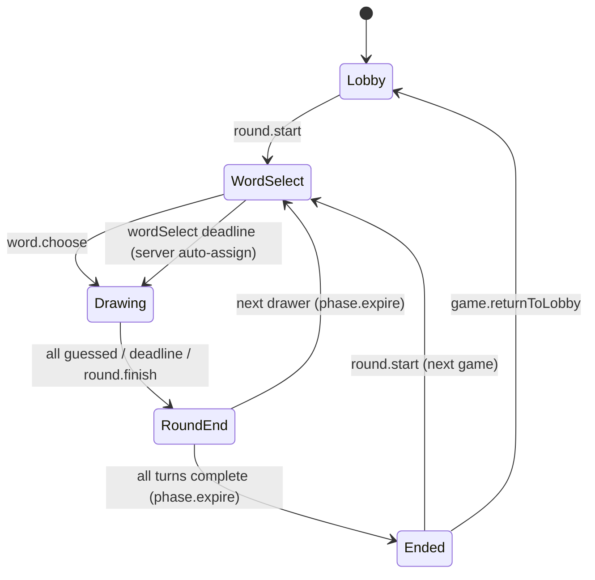

# 你画我猜设计

> 状态：设计待确认（D1–D8 已由用户 2026-10-02 拍板）
> 游戏 ID（拟）：`drawguess`（与接龙版 `pictionary` 区分）
> 展示名（拟）：你画我猜
> 最后更新：2026-10-02
> 关联文档：[你画我猜接龙设计](./werewolf/docs/pictionary-game-design.md)、[多游戏平台架构](./werewolf/docs/multigame-platform-design.md)、[方案草稿](./draw-guess-proposal.md)

## 1. 目标

你画我猜是第六个正式游戏，对标 [Gartic.io](https://gartic.io/) 的经典模式：每轮一人作画，其余玩家在聊天框里打字猜词，猜中按速度计分，画手按猜中人数得分，按座位顺序轮换画手，每人画 2 轮，终局按总分排名。

本方案遵守现有平台边界：

- 服务端是游戏规则和阶段推进的唯一权威。
- `GameState` 是唯一权威状态，不建立客户端或 D1 的第二份游戏状态。
- 复用共享房间、座位、连接、重连、用户资料和分享基础设施。
- 游戏规则进入 `packages/game-engine`；Worker 负责认证、持久化、媒体和广播；客户端负责输入与展示。
- 笔画以「整笔」为粒度经游戏命令进入 Durable Object 状态并随全量快照广播（延迟约 200–500ms）。这是相对接龙版「画作二进制不进入 DO 状态」的一处**有意的、经评审的设计例外**：接龙版不需要直播作画过程，本游戏需要；断线/迟加入的玩家靠权威 state 自动恢复完整当前画作。

Gartic 模式的 7 个关键行为在本设计中的落点：轮流作画见 §3.1/§5，聊天框猜词见 §3.3/§9.3，速度计分见 §3.3，画手按猜中人数得分见 §3.3，拼音首字母渐显见 §3.4/§5.3，答案隐藏见 §3.3/§7.3，作画禁写字见 §3.5/§9.2。

## 2. 已确认产品决策

用户已于 2026-10-02 亲口拍板，以下决策不再更改：

| 项目             | 决策                                                                                    |
| ---------------- | --------------------------------------------------------------------------------------- |
| 玩法对标         | Gartic.io 经典模式：轮流一人画、其余人在聊天框打字猜                                    |
| 选词（D1=B）     | 画手从服务端给出的 3 个候选词中选 1 个；15 秒未选则服务端随机指派                       |
| 计分（D2）       | 猜中者按速度递减：`50 + round(100 × 剩余时间/90秒)`；画手每被一人猜中 +20（常量均可调） |
| 轮数（D3=2）     | 每人画 2 轮，按座位顺序轮换                                                             |
| 机器人（D4=B）   | 沿用仓库现有模式：空座补隐式机器人，由真人接管代打；无自主 AI（见 §10）                 |
| 猜中锁定（D5=A） | 猜中者本轮锁定；猜中的答案对其他猜题者隐藏，只显示"xxx 猜中了"                          |
| 提示（D6）       | 题目显示字数 + 拼音首字母占位，每 20 秒揭示一个首字母（随机顺序，可全部揭示）           |
| 时长（D7=90）    | 每轮绘画 90 秒                                                                          |
| 画手视野（D8=A） | 画手实时看到猜词聊天流                                                                  |
| 作画规则         | 不许写字、数字；画布不提供文字工具，属房间规则（信任模型，不做自动检测）                |
| 玩家人数         | 4–12 人，默认 6 人；开局要求坐满配置人数（真人+隐式机器人），与故事接龙等一致           |
| 终局             | 按总分排名；同分并列，按竞赛排名 1,2,2,4（下一名次跳过）                                |

## 3. 核心玩法

### 3.1 一局流程

```text
大厅坐满（真人+机器人补齐）
→ 房主开始游戏，服务端生成画手队列（座位升序）
→ wordSelect：当前画手从 3 个候选词中选 1 个（15 秒）
→ drawing：画手作画（90 秒），猜题者在聊天框猜词，笔画整笔广播，拼音首字母每 20 秒揭示一个
→ 超时 / 画手放弃 → roundEnd：公布答案、展示画作、本轮得分（8 秒）
  （Gartic.io 规则：猜中不提前结束，只等计时器；2026-10-04 实测第三方攻略确认）
→ 下一画手进入 wordSelect，直到每人画完 2 轮
→ ended：总分排名
→ 再来一局 或 返回大厅
```

画手在自己的回合只能看到题目和聊天流；猜题者看不到答案，只能看到字数 + 拼音首字母提示（如"3个字 · d \_ \_"）。

### 3.2 画手轮换

开局时服务端按**座位升序**生成 `drawerQueue`（含隐式机器人席位），写入权威状态，重连不得重新生成。

- 总回合数 = `drawerQueue.length × 2`（D3=2，每人画 2 轮）。
- 第 $t$ 回合（$t$ 从 0 开始）的画手为 `drawerQueue[t mod n]`，第几轮为 `floor(t / n) + 1`。
- 轮到隐式机器人席位当画手时：由接管的真人代画（机器人仅用于测试/凑人数，玩家会接管）。若超时仍无人接管或无作画，按画手超时处理：本轮直接结算、无人得分。

### 3.3 猜词与计分

猜题者在 `drawing` 阶段通过聊天框提交猜词（`drawguess.guess.submit`）：

- 服务端做权威归一化后比对：去除所有空白字符（含全角空格）、剥离 CJK 标点（如"。！，？"）、全角 ASCII 转半角；必须与答案**完全一致**才算猜中。
- 本游戏仅支持简体中文：词库只收简体词，V1 不做繁简映射；猜词输入框占位提示"请用简体输入"。
- 猜中者立即得分并锁定（D5=A）：锁定后该座位的后续 `guess.submit` 被拒绝，输入框置灰。
- 猜中的答案对其他猜题者隐藏：聊天流只显示"xxx 猜中了"，不显示答案文本（见 §7 visibility）。
- 画手本人（及接管画手席位的真人）不能提交猜词。
- **聊天框是核心互动区**：猜中消息高亮显示（自己猜中 🎉 主色边框，他人猜中 🎯 成功色边框），画手余光可扫到猜中动态。

**作画阶段响应式布局**（对齐 Pictionary）：

- **宽屏（≥768px）**：左右分栏。画布居左占主要区域；右侧 320px 固定栏，上半为工具条（画笔/橡皮/颜色/粗细/撤销/清空），下半为聊天框（占右侧 ≥60% 高度，保证 4-5 条消息可见）。
- **窄屏（<768px）**：上下堆叠。画布在上，工具条和聊天框在下全宽显示，聊天框最小高度 200px。
- 画手与猜题者布局一致，画手多工具条，猜题者多输入框。

计分公式（全部为命名常量，可调，计分在 engine `evolve` 里算，服务端权威）：

```text
GUESS_BASE_SCORE = 50                      // 猜中保底分
GUESS_SPEED_BONUS_MAX = 100                // 速度加成上限
DRAWING_DURATION_SECONDS = 90              // D7

guesserScore = GUESS_BASE_SCORE
             + round(GUESS_SPEED_BONUS_MAX × 剩余毫秒 / (90 × 1000))
// 开局即猜中得 150 分，压哨猜中得 50 分

DRAWER_PER_GUESS_SCORE = 20                // 画手每被一人猜中所得
drawerScore = DRAWER_PER_GUESS_SCORE × 本轮猜中人数
```

- 同一答案多人猜中各自按自己的猜中时刻计分，互不影响。
- 本轮得分记入 `roundScores`（`roundEnd` 展示），同时累加到 `scores` 总分。

### 3.4 拼音首字母渐显（D6）

> 中文词只有 1–8 个字，揭示整个汉字等于直接送答案——"汉字渐显"方案不可玩。
> 改为揭示**拼音首字母**：这是中文语境下对 Gartic 字母提示的正确类比（渐进的正字法线索，帮助但不剧透），且中文玩家对拼音首字母缩写高度熟悉。

- 猜题者看到的题目提示：字数 + 首字母占位，如"大熊猫"显示为"3个字 · d \_ \_"。
- `HINT_REVEAL_INTERVAL_SECONDS = 20`：从 `drawing` 开始每 20 秒揭示一个未揭示的首字母。
- 揭示顺序 `revealOrder` 在 `word.choose` 时由服务端用命令的 `randomSeed` 生成并写入权威状态，保证所有客户端一致、重连不重新随机。
- 首字母**可以全部揭示**（如"d x m"仍需结合画作推理，不直接泄露答案），不设上限：`revealedCount = min(floor(已进行秒数 / 20), 字数)`；客户端只做显示，不拥有揭示逻辑。

### 拼音数据来源

- `drawguess_words` 表新增 `pinyin_initials TEXT NOT NULL` 列（如"大熊猫"→"dxm"）。
- 词语入库时由服务端拼音库一次性生成（实现时选型轻量拼音库）；多音字取常用读音，入库评审时人工确认。
- visibility：猜题者 view model 只暴露服务端按当前进度算好的展示串（如"d \_ m"），不暴露完整首字母串；画手看到题目原文。

### 3.5 作画规则

- 作画不许写字、数字（Gartic 规则）。画布工具不提供文字工具（沿用接龙版约束），属房间规则页明示的房间规则。
- 沿用仓库「同桌面信任模型」：不做笔画内容的自动检测与判罚。
- 画手可随时"放弃本轮"（`drawguess.round.finish`，需二次确认），直接进入 `roundEnd` 公布答案。

## 4. 房间设置

配置页使用数值 stepper、预设选项和预计时长摘要。只有大厅阶段可以修改设置。

| 设置     | 默认值 | V1 可选值             |
| -------- | ------ | --------------------- |
| 玩家人数 | 6      | 4–12 的整数           |
| 绘画时间 | 90 秒  | 固定 90 秒（D7 已定） |
| 每人轮数 | 2 轮   | 固定 2 轮（D3 已定）  |
| 选词时间 | 15 秒  | 固定 15 秒            |
| 结算展示 | 8 秒   | 固定 8 秒             |
| 补机器人 | 关     | 开 / 关               |

绘画时间、轮数、选词时间按用户已拍板决策固定为常量（代码中仍为命名常量，可调），配置页不提供选项，避免无意义组合。

缩小房间人数时遵循共享座位规则：目标范围外存在真人时拒绝；游戏已开始时所有配置更新都拒绝。

### 4.1 预计时长

设单回合固定耗时：选词 15 秒 + 绘画 90 秒 + 结算 8 秒 = 113 秒。总回合数 = 人数 × 2。

$$
T_{total} = n \times 2 \times 113\text{秒}
$$

- 3 人局约 11 分钟。
- 6 人局（默认）约 23 分钟。
- 12 人局约 45 分钟。

实际绘画阶段可因全员提前猜中或画手放弃而缩短；配置页按固定公式估算并注明"提前猜中会缩短"。

## 5. 状态机与计时



平台 lifecycle 映射：

| DrawGuess phase                       | Platform lifecycle |
| ------------------------------------- | ------------------ |
| `lobby`                               | `setup`            |
| `wordSelect` / `drawing` / `roundEnd` | `ongoing`          |
| `ended`                               | `ended`            |

### 5.1 权威时间

- 权威状态保存绝对 `deadlineAt`（毫秒时间戳），不保存"剩余秒数"；`drawing` 另保存 `phaseStartAt` 用于推导首字母揭示进度。
- Worker 用服务端时间判断命令是否有效；客户端时间只用于显示。
- 任一在线客户端都可在 deadline 后请求推进，服务端只接受首个匹配当前 `phaseRevision` 的请求。
- 并发的过期推进是幂等操作：第一个请求推进状态，后续请求收到最新状态，不重复计分、不重复揭示。
- 重连恢复同一个 deadline，不重新获得完整作画时间；首字母揭示进度按 `phaseStartAt` 重新推导，不重置。
- 全员离线时不让 Durable Object 空转；首个客户端重连后立即补推进已过期阶段。
- 补推进只结束当前过期阶段。下一阶段从实际推进时间开始，不能因离线过久一次跳完整局。
- 现有 DO alarm 继续专用于通用 effect outbox，本游戏不抢占 alarm。

### 5.2 阶段推进规则

- `wordSelect` 到期画手未选词：服务端从 3 个候选中随机指派一个（用命令 `randomSeed`），直接进入 `drawing`，不卡住全房。
- `wordSelect` / `drawing` 轮到未被接管的机器人画手：不跳过，等待真人接管；若 deadline 到达时仍无人接管（或无有效作画），按画手超时处理，本轮直接进入 `roundEnd`、无人得分。
- `drawing` 结束条件：`deadlineAt` 到达；画手或房主执行 `round.finish`（画手放弃需二次确认）。
  （Gartic.io 规则：无"全员猜中提前结束"；2026-10-04 实测确认）
- `roundEnd` 8 秒后由 `phase.expire` 自动推进到下一画手的 `wordSelect`；全部回合完成后推进到 `ended`。
- `ended` 由房主执行 `round.start` 再来一局（重新生成队列、清零比分）或 `game.returnToLobby` 返回大厅。

### 5.3 拼音首字母揭示计时

- 揭示进度是 `drawing` 权威状态的派生值：`revealedCount = min(floor((nowMs - phaseStartAt) / 20000), wordLength)`（首字母可全部揭示）。
- 服务端在每次 `guess.submit` 判定和快照裁剪时按当前 `nowMs` 计算；客户端显示层同样用本地时间的同一公式推导 tick 显示，不等待服务端推送。
- 暂停/重连不改变 `phaseStartAt`，揭示进度单调递增，不回退。

## 6. 权威数据模型

以下是设计形状，最终实现名称以 engine 中的领域类型为准。

```ts
interface DrawGuessConfig {
  readonly numberOfPlayers: number; // 4–12
  readonly drawingDurationSeconds: 90; // D7，固定
  readonly roundsPerDrawer: 2; // D3，固定
  readonly wordSelectSeconds: 15;
  readonly roundEndSeconds: 8;
  readonly hintRevealIntervalSeconds: 20; // D6
  readonly fillEmptySeatsWithBots: boolean; // D4
}

// 整笔数据模型：从接龙版复制（游戏间禁互相 import，见 §12）
interface DrawGuessStroke {
  readonly id: string;
  readonly kind: 'brush' | 'eraser' | 'line' | 'rectangle' | 'ellipse' | 'fill';
  readonly color: string;
  readonly width: number;
  readonly points: ReadonlyArray<{ readonly x: number; readonly y: number }>; // 归一化 0–1
  readonly start?: { readonly x: number; readonly y: number };
  readonly end?: { readonly x: number; readonly y: number };
  readonly authorSeat: number;
}

type DrawGuessPhase =
  | { readonly kind: 'lobby' }
  | {
      readonly kind: 'wordSelect';
      readonly drawerSeat: number;
      readonly choices: readonly string[]; // 仅画手可见
      readonly deadlineAt: number;
    }
  | {
      readonly kind: 'drawing';
      readonly drawerSeat: number;
      readonly word: string; // 仅画手可见，见 §7 visibility
      readonly pinyinInitials: string; // 与 word 等长，入库时生成；猜题者只能看到按进度揭示的展示串
      readonly revealOrder: readonly number[]; // 首字母揭示顺序（字符索引）
      readonly strokes: readonly DrawGuessStroke[]; // 当前轮笔画
      readonly guessedSeats: readonly number[]; // 已猜中锁定席位（D5）
      readonly guessLog: ReadonlyArray<{
        readonly seat: number;
        readonly text: string; // 猜中者的 text 在 view model 中被隐藏
        readonly correct: boolean;
        readonly at: number;
      }>;
      readonly phaseStartAt: number;
      readonly deadlineAt: number;
    }
  | {
      readonly kind: 'roundEnd';
      readonly drawerSeat: number;
      readonly word: string;
      readonly strokes: readonly DrawGuessStroke[]; // 保留用于展示，下一回合清空
      readonly roundScores: Readonly<Record<number, number>>; // seat -> 本轮得分
      readonly pngEntry: DrawGuessMedia | null; // 终稿 PNG，commit 后填充
      readonly deadlineAt: number;
    }
  | {
      readonly kind: 'ended';
      readonly totalScores: Readonly<Record<number, number>>;
    };

interface DrawGuessMedia {
  readonly objectKey: string;
  readonly contentType: 'image/png';
  readonly width: 1024;
  readonly height: 768;
  readonly byteLength: number;
  readonly sha256: string;
}

interface DrawGuessState {
  readonly stateVersion: number;
  readonly roomCode: string;
  readonly hostUserId: string;
  readonly realSeats: Readonly<Record<number, SeatOccupant | undefined>>;
  readonly excludedBotSeats: readonly number[];
  readonly config: DrawGuessConfig;
  readonly phase: DrawGuessPhase;
  readonly phaseRevision: number; // 单调递增
  readonly drawerQueue: readonly number[]; // 座位升序
  readonly turnIndex: number; // 当前第几回合（从 0 开始）
  readonly scores: Readonly<Record<number, number>>; // seat -> 总分
  readonly usedWords: readonly string[]; // 本局已用题目，避免重复
}
```

`DrawGuessState` 还保存：`stateVersion`、`roomCode`、`hostUserId` 和共享座位状态。不保存：

- PNG、二进制画作字节（只保存 R2 object key 与元数据）。
- 本地撤销栈、未发送的笔画、未提交的猜词输入。
- 可推导的第二份"已猜中集合"（`guessedSeats` 即权威）。

Codec 必须用 `z.strictObject` 精确验证：座位范围、笔画字段、阶段不变量（`drawing` 的 `word` 非空、`pinyinInitials.length === word.length`、`guessedSeats` 不含画手、`turnIndex` 上界）；损坏状态直接失败，不猜测修复。

## 7. 命令与权限

### 7.1 Public commands

| 命令                           | 发送方                                     | 阶段              | 说明                                                               |
| ------------------------------ | ------------------------------------------ | ----------------- | ------------------------------------------------------------------ |
| `drawguess.config.update`      | 房主                                       | `lobby`           | 修改配置（人数）                                                   |
| `drawguess.round.start`        | 房主                                       | `lobby` / `ended` | 开始游戏：生成画手队列、清零比分；`ended` 时为再来一局             |
| `drawguess.word.choose`        | 画手（或接管人）                           | `wordSelect`      | 从 3 个候选中选定题目，生成 `revealOrder`                          |
| `drawguess.stroke.add`         | 画手（或接管人）                           | `drawing`         | 整笔提交（客户端 `onElementComplete` 触发）                        |
| `drawguess.stroke.undo`        | 画手（或接管人）                           | `drawing`         | 撤销最后一笔（广播，否则画面分叉）；V1 无重做                      |
| `drawguess.stroke.clear`       | 画手（或接管人）                           | `drawing`         | 清空画布（客户端二次确认）                                         |
| `drawguess.guess.submit`       | 已入座的非画手、未锁定猜题者（或其接管人） | `drawing`         | 提交猜词；客户端节流 1 次/2 秒，服务端 per-seat 速率限制（见 §13） |
| `drawguess.drawing.reserve`    | 画手                                       | `roundEnd`        | 获取终稿 PNG 的一次性 `submissionId`                               |
| `drawguess.round.finish`       | 画手 / 房主                                | `drawing`         | 画手放弃本轮（画手需二次确认），直接进入 `roundEnd`                |
| `drawguess.phase.expire`       | 任一已认证房间成员                         | 任意              | deadline 到点推进；幂等（匹配 `phaseRevision`）                    |
| `drawguess.game.returnToLobby` | 房主                                       | `ended`           | 返回大厅                                                           |

共享入座、离座、踢人和房间操作继续使用平台命令，不复制 DrawGuess 版本。

`word.choose` / `stroke.*` / `guess.submit` 必须携带 `phaseRevision`（和 `turnIndex`），客户端在用户操作时绑定当时的快照；旧回合命令明确拒绝。

### 7.2 Internal commands

- `drawguess.drawing.commit`：终稿 PNG 入册。只能由已认证的游戏媒体 HTTP 路由构造，携带服务端生成的 R2 object key 与摘要。公开命令 schema 不接受 object key，防止客户端伪造其他房间的媒体引用。

### 7.3 权限矩阵

| 操作                                                      | 权限                                                                               |
| --------------------------------------------------------- | ---------------------------------------------------------------------------------- |
| 修改配置、开始游戏、再来一局、返回大厅、结束绘画轮        | 房主，且阶段合法                                                                   |
| 选词、作画（笔画/撤销/清空）、放弃本轮                    | 当前画手席位对应的已入座用户；机器人席位仅房主可接管代打                           |
| 提交猜词                                                  | `drawing` 阶段中、非画手、未锁定（未猜中）的已入座用户；机器人席位仅房主可接管代猜 |
| 获取 PNG 预留                                             | 当前画手                                                                           |
| 提交图片元数据                                            | Worker 内部媒体路由                                                                |
| 请求 deadline 推进                                        | 任一已认证房间成员                                                                 |
| 查看答案（`word` / `choices` / 未隐藏的 `guessLog.text`） | 仅画手（visibility 裁剪，见下）                                                    |

**Visibility 裁剪**（仿 fibking visibility 模式）：

- `wordSelect.choices`：只对画手可见，其他人 view model 中该字段为空。
- `drawing.word` / `drawing.pinyinInitials`：只对画手可见；猜题者 view model 只给 `{ wordLength, hintText }`，其中 `hintText` 是服务端按当前揭示进度算好的展示串（如"d \_ m"）。
- `guessLog`：`correct=true` 的条目，`text` 在猜题者 view model 中被替换为隐藏标记，客户端渲染为"xxx 猜中了"；画手 view model 可见完整文本（D8=A，画手看聊天流）。
- `roundEnd`：`word` 对全员可见（公布答案）；`strokes` 对全员可见。
- 房主只是 UI 和权限标记。所有命令仍在同一个 Worker/DO 权威路径完成 read-compute-write-broadcast。

## 8. 媒体存储与 API

### 8.1 R2

- 复用私有 `GAME_MEDIA` R2 bucket（接龙版已建），不新建 bucket。
- 对 `drawguess/` 前缀配置 48 小时生命周期（与 `pictionary/` 一致）。
- object key 由服务端生成：`drawguess/{creationId}/{phaseRevision}/turn-{turnIndex}/{submissionId}.png`，包含 `creationId`、单调递增的 `phaseRevision` 和 `submissionId`，不只使用可复用的房间号。用 `phaseRevision` 而不用 `roundId` 是因为 engine state 里没有 `roundId` 字段；`phaseRevision` 保证"再来一局"后 turnIndex 复用不产生 key 碰撞。
- R2 对象不可变；重试使用同一 `submissionId` 和摘要，内容冲突直接拒绝。
- DO 状态只保存已接受对象的 key 和元数据（`roundEnd.pngEntry`）。
- `drawing` 阶段的实时笔画**不走 R2**，只进 DO 状态（本游戏经评审的设计例外，见 §1）。

### 8.2 上传接口

```text
PUT /api/games/drawguess/rooms/:roomCode/submissions/:submissionId
Content-Type: image/png
```

画手在 `roundEnd` 阶段将终稿（当前轮全部笔画）渲染为 PNG 后上传，用于结算展示。处理顺序与接龙版一致：

1. 验证登录态、房间成员身份和请求大小。
2. 向目标 DO 验证 `submissionId` 属于该画手当前回合的上传预留；重放也必须校验作者与内容摘要。
3. 校验 PNG 文件签名、解码尺寸、固定 4:3 比例和大小上限。
4. 在大小上限内读取后条件写入 `GAME_MEDIA`，已有对象必须与本次内容相同。
5. 计算并保存字节数、SHA-256 和 R2 object key。
6. 通过现有原子命令管线提交内部 `drawguess.drawing.commit`。
7. 返回最新命令结果；不能把"上传成功"误报为"已接受"。

V1 画作规格固定为 1024×768 PNG，单文件最大 2 MiB。SVG、动画图片和客户端提供的 object key 一律拒绝。

### 8.3 读取接口

```text
GET /api/games/drawguess/rooms/:roomCode/media/:entryId
```

- 验证登录态与房间成员身份。
- 让 DO 根据 `entryId` 找到权威 object key，不接受路径形式的 key。
- 只允许在 `roundEnd` / `ended` 阶段读取本局已提交的终稿 PNG。
- 返回 `ETag`、明确的私有缓存策略和 `X-Content-Type-Options: nosniff`。
- R2 对象缺失时返回明确错误，不用空白图片掩盖数据损坏；客户端降级为用 state 中的 `strokes` 本地渲染。

### 8.4 保留与隐私

- 画作和猜词属于用户生成内容，不写入日志、Sentry breadcrumb 或分析事件。
- 房间元数据继续遵循现有 24 小时清理；R2 使用 48 小时保留，为重连和清理延迟留出余量。
- 上线前更新隐私说明，明确临时画作的用途与保留时间。
- V1 房间内容不公开索引，不提供永久作品库。

## 9. 客户端体验

### 9.1 配置与大厅

- 首页通过 client game catalog 显示"你画我猜"（与"你画我猜接龙"区分）。
- 配置页展示：玩家人数（4–12 stepper），以及预计总时长（见 §4.1）；开始按钮仅在坐满配置人数（真人+隐式机器人）时启用，未满时提示"座位尚未坐满"。
- 房间沿用共享 `RoomShell`、座位、头像、分享、房间号与连接状态。
- 开始按钮只在坐满配置人数（真人+隐式机器人）时启用，未满时明确提示"座位尚未坐满"。
- 规则说明页明示：轮流作画、聊天框猜词、速度计分、拼音首字母提示、作画不许写字/数字、机器人由房主接管代打。
- 游戏开始后锁定座位，不允许换座、踢人或新增玩家。

### 9.2 画手视图

- `wordSelect`：全屏展示 3 个候选词卡片（仅画手可见），15 秒倒计时；超时未选服务端自动随机指派，客户端按快照切换。
- `drawing`：上方为题目条（答案+字数），下方为 4:3 画布与单行工具栏，右侧/下方为猜词聊天流（D8=A）。
- 工具栏：画笔、橡皮擦、直线、矩形、椭圆、填充桶、颜色、笔宽、撤销、清空（复用接龙版工具规格，不提供文字工具）。
- **关键差异**：撤销、清空不再是纯本地操作，而是发送 `stroke.undo` / `stroke.clear` 命令并等待服务端广播；本地先乐观更新，冲突时以权威快照为准。
- "放弃本轮"按钮在工具面板内，需二次确认，发送 `round.finish`。
- 画手在聊天流中看到所有猜词（含"xxx 猜中了"提示），可据此调整画法。

### 9.3 猜题者视图

- 上方为题目提示条：字数 + 拼音首字母提示（如"3个字 · p \_ \_"），随 §5.3 的节奏更新。
- 中部为只读画布（`isEnabled={false}`，从权威 `strokes` 渲染，不接受手势），整笔粒度近实时更新。
- 下方为聊天式猜词区：输入框 + 发送按钮 + 消息流。未猜中者的消息原文对全员可见；猜中者显示为"xxx 猜中了"（答案隐藏，D5=A）。
- 猜中后输入框置灰锁定，显示"已猜中，等待本轮结束"；本轮内不可再猜。
- 客户端对 `guess.submit` 做 1 次/2 秒节流，超限时输入框抖动提示"慢一点"，不发送命令。
- 服务端速率限制拒绝（429）时显示"猜得太快了，稍后再试"。

### 9.4 画布规格

- 复用接龙版 Skia 画布能力（`@shopify/react-native-skia` + `react-native-gesture-handler`），跨 Web/iOS/Android；实现上从接龙版**复制** `PictionaryDrawingCanvas` 与笔画数据模型为 `DrawGuessCanvas` / `drawGuessDrawing.ts`（注明来源），游戏间禁止互相 import，待双游戏验证通用后再提取到平台层。
- 本地绘图模型使用归一化 0–1 坐标；细/中/粗笔宽以 1024×768 导出坐标定义。
- `onElementComplete`（笔画结束）即发送 `stroke.add`，为天然节流；`onElementChange` 的逐点回调不发送命令。
- 猜题者端同一组件以 `isEnabled={false}` 只读渲染；不断线重连后从权威 `strokes` 全量恢复当前画作。
- V1 不提供重做（redo）：`stroke.undo` 弹出画手最后一笔；撤销后再画新笔画不恢复已撤销内容，避免同步分叉。
- 固定色板十色（黑白红橙黄绿青蓝紫粉，白色块有可见边框）；导出画布背景固定白色。

### 9.5 倒计时组件与行为

`useDrawGuessDeadline` 从权威 `deadlineAt` 推导剩余秒数，约束与接龙版一致：

- 阶段栏右侧固定宽度 `mm:ss` 等宽数字；最后 5 秒逐秒醒目提示，不遮挡画布、不拦截输入。
- 客户端每秒只更新显示 tick，剩余时间始终从 `deadlineAt - Date.now()` 重新推导。
- 本地估算到 0 时立即停止新输入（画手停笔、猜题者停发），发送一次幂等 `phase.expire`；服务端判定尚未到期则按快照恢复。
- 同一 `phaseRevision` 的到点请求保持 single-flight；App 回前台/收到新 snapshot 立即重算。
- 画布手势、色板展开、键盘弹起均不得重置倒计时。

### 9.6 结算与终局

- `roundEnd`：展示本轮画作（优先 R2 PNG，缺失则用 `strokes` 本地渲染）、公布答案、本轮得分明细（猜中者与得分、画手得分），8 秒后自动进入下一回合。
- `ended`：总分排行榜（按 `scores` 降序，含头像与名次），房主可见"再来一局"与"返回大厅"。
- 结算页不直接展示房主流程按钮以外的游戏外操作；"再来一局"重新走 `round.start` 完整初始化。

### 9.7 响应式布局

- 游戏工作区最大宽度 430px 水平居中（与接龙版一致）；画布在可用宽高内取等比 4:3，不裁切、不拉伸。
- 手机竖屏单列：题目条/提示条 → 画布 → 聊天流/工具栏 → 主操作，无需整页滚动即可作画或猜词。
- 聊天流区域固定高度、内部滚动；键盘弹起时使用 `KeyboardAvoidingView`（原生）/ `visualViewport`（Web）避让，不顶起画布。
- 320px 宽度下工具栏图标保持单行且至少 44px 点击区域。

### 9.8 无障碍、动效与防误触

- 所有可点击目标至少 44×44，图标按钮有可读中文名称；颜色 swatch 同时提供颜色名称。
- 读屏：作画阶段将画布描述为"画手正在作画"，不得朗读答案；`roundEnd` 公布答案后才可朗读。
- 猜中提示使用 polite live region；倒计时最后 3 秒有限播报；速率限制与提交失败使用 assertive 提示。
- 遵循系统 reduced motion：取消数字缩放与闪烁，保留瞬时状态变化。
- 放弃本轮、清空画布使用独立二次确认；不使用时间戳 debounce 掩盖事件穿透。

### 9.9 客户端组件边界

| 组件/模块                | 职责                                                          |
| ------------------------ | ------------------------------------------------------------- |
| `DrawGuessRoomScreen`    | 根据权威 phase 选择画手/猜题者/结算视图，不实现各阶段业务细节 |
| `DrawGuessCanvas`        | 指针事件、归一化笔画、只读渲染（从接龙版复制）                |
| `DrawGuessToolbar`       | 工具、色板、笔宽、撤销、清空、放弃本轮                        |
| `DrawGuessGuessPanel`    | 猜词输入、节流、聊天流渲染、锁定态                            |
| `DrawGuessHintBar`       | 字数 + 拼音首字母提示展示                                     |
| `DrawGuessScoreboard`    | 本轮得分与总分榜                                              |
| `useDrawGuessStrokeSync` | 整笔发送、从 state 增量渲染、断线恢复                         |
| `useDrawGuessDeadline`   | deadline tick、前后台恢复、single-flight 到点请求             |

UI 组件只接收已按当前用户可见性裁剪的 view model。组件不得直接读取权威 `word` / `choices` 字段，也不得自行判断服务端权限。

## 10. 机器人机制

> 已按代码核实（2026-10-02）：仓库里**没有任何游戏有自主 AI 机器人**。所有"机器人"都是空座位填充器，不会自动行动；靠真人接管代打。

### 现有各游戏的实际做法

- **瞎掰王 / 你画我猜接龙**：`fillEmptySeatsWithBots` 开关（房主在大厅点"补机器人"）。空座变成隐式机器人席位，显示名 `机器人X号`。判定函数 `isFibImplicitBotSeat` / `isPictionaryImplicitBotSeat`：开了补机器人开关、座位在人数范围内、没有真人坐、没被踢过。
- **接管（takeover）**：机器人席位的所有游戏操作由真人通过 `CommandContext.controlledSeat` 代发。接龙版只允许**房主**接管（`actor.value !== state.hostUserId` 则拒绝）；瞎掰王客户端是长按机器人头像接管。engine 侧校验接管的必须是隐式机器人席位，否则 `REASON_CONTROLLED_SEAT_NOT_BOT` 拒绝。
- **踢出/清理**：房主可踢掉单个机器人席位（`botSeat.excluded`），清空座位自动关闭补机器人。
- **狼人杀**：`fillWithBots` 是纯调试功能，生产玩法无机器人。

### drawguess 的机器人规则（D4=B）

- 大厅"填充机器人"按钮（一键） → 空座变隐式机器人（`isDrawGuessImplicitBotSeat`，与瞎掰王/接龙版同构）；想清空机器人用"清空座位"（与狼人杀/故事接龙/卧底统一，无单独"移除机器人"按钮）。
- 机器人席位当画手：由**房主接管**代画（沿用接龙版规则；机器人仅用于测试/凑人数，玩家会接管）；若超时无人接管，按画手超时处理，不自动跳过。
- 机器人席位当猜题者：无人接管则永不猜词；房主可接管代猜。
- 真正的 AI 画手/AI 猜题不在本次范围。

## 11. 断线与异常规则

| 场景                    | 权威行为                                                                                                                 | 客户端反馈                                    |
| ----------------------- | ------------------------------------------------------------------------------------------------------------------------ | --------------------------------------------- |
| 画手短暂断线            | 座位与 `deadlineAt` 保留；已广播笔画全在 state 中                                                                        | 重连后从 `strokes` 恢复完整当前画作，继续作画 |
| 猜题者短暂断线          | 猜中记录与锁定态保留                                                                                                     | 重连后恢复聊天流、首字母揭示进度与锁定态      |
| `stroke.add` 发送失败   | 命令幂等（客户端 stroke id），重放不重复入画                                                                             | 自动退避重试；冲突以权威快照为准              |
| `guess.submit` 响应丢失 | 相同幂等键返回既有判定结果                                                                                               | 快照确认后停止重试                            |
| 速率限制命中            | Worker 拒绝并返回 429，不入 engine                                                                                       | "猜得太快了，稍后再试"                        |
| 房主断线                | 游戏继续；其他客户端可触发 `phase.expire`                                                                                | 不转移权威时间，不暂停全局                    |
| 房主缺席终局（`ended`） | 沿用其他游戏做法：**不转移房主身份**（`hostUserId` 建房写死，平台无转移机制）；`再来一局`/`返回大厅`等房主专属操作不可用 | 提示"等待房主操作"；房间按平台过期策略回收    |
| 全员离线                | 不推进；首个重连者补推进当前过期阶段                                                                                     | 进入最近的下一合法阶段                        |
| 终稿 PNG 上传失败       | `roundEnd` 保持，`pngEntry` 为 null                                                                                      | 自动重试；结算页降级用 `strokes` 本地渲染展示 |
| R2 不可用               | 不接受 `drawing.commit`，不写入悬空引用                                                                                  | 保留重试，不阻塞阶段推进                      |
| DO 状态损坏             | Codec fail fast，禁止猜测恢复                                                                                            | 记录错误、Sentry 上报、显示房间异常           |

关键异常遵循现有三层处理：项目 logger、Sentry 和具体中文 UI 反馈。预期的过期、重复、权限拒绝与速率限制使用 warning 与用户反馈，不上报为系统故障。

## 12. 架构接入

### 12.1 Game engine

新增 `packages/game-engine/src/games/drawguess/`，按 FibKing/接龙版的模块边界组织：

- `state/`：状态类型、严格 codec（`z.strictObject`）、normalize 与派生查询（含 `isDrawGuessImplicitBotSeat`、`getDrawGuessBotDisplayName`）。
- `commands/`：配置、开局、选词、笔画、猜词、超时、结算与返回大厅命令类型。
- `domain/`：`decision.ts`（选词/笔画/猜词/超时/轮换）、`evolve.ts`、`rules.ts`（计分公式、猜词归一化、揭示顺序生成）、`visibility.ts`（答案裁剪）。
- `engine.ts`、`public.ts`。

同时：

- 将 `drawguess` 加入 `platform/protocol/gameTypes.ts` 的 `GAME_TYPES`（合法 ID 唯一来源）与 engine catalog。
- 所有时间、人数、计分、揭示间隔常量从 game-engine public exports 复用，不在 Worker/客户端硬编码。

**架构约束（强制）**：

- 不得在平台文件出现 `if (gameType === 'drawguess')`；新 gameType 只走三处 catalog 注册，平台文件零改动。
- engine 为纯函数：不得 import Zod（codec 除外）/ React / logger；R2 字节不进入 engine。
- state codec 必须 `z.strictObject`，拒绝未知字段；normalize 损坏状态 fail-fast。
- 仓库 contract test 硬门槛（`pnpm run quality` 前置）：新文件禁止字面量样式值（`fontSize: 14` 之类一律走 `@/theme` 的 spacing/typography/borderRadius token）；生产代码禁止普通 `as` 断言（只允许 `as const`），类型收窄用 zod parse。

### 12.2 API Worker

新增 `packages/api-worker/src/games/drawguess/`：

- `module.ts`：Worker game module 与游戏 HTTP routes。
- `schemas.ts`：create config、public/internal command schema（`z.strictObject`，public/internal 区分）。
- `mediaRoutes.ts`：`drawing.reserve` 校验与终稿 PNG 上传/读取（§8.2/§8.3）。
- `mediaValidation.ts`：PNG 签名、尺寸、大小、摘要（逻辑可复用接龙版，**复制**而非跨游戏 import）。
- `dbSchema.ts`：`drawguess_words` 词库表（服务端 D1，见下）。

平台改动仅限组合与基础设施：

- Worker game catalog 注册新模块。
- D1 migration：在所有含 `game_type CHECK (...)` 的表上加 `'drawguess'`（仿 0049/0056/0059 模式）。
- `drawguess_words` 表：`word`（2–8 简体汉字，具象名词优先，适合绘画）、`category`、`pinyin_initials`（入库时拼音库生成，如"大熊猫"→"dxm"，多音字取常用读音人工确认）；服务端开局/选词时随机取 3 个未用过的词。**不复用** `fib_words`（跨游戏 import 违反架构约束，且瞎掰王词多为抽象词，不适合绘画）。

V1 不新增 D1 对局表。游戏权威状态保存在 DO SQLite，R2 保存终稿图片。

### 12.3 Client

新增 `src/games/drawguess/`：

- `module.ts`：client game module（`createDrawGuessUiModule`）。
- `home/`：首页卡片（展示名"你画我猜"）。
- `navigation/`：配置、规则、房间内页面导航。
- `screens/`：`DrawGuessConfigScreen`、`DrawGuessRulesScreen`。
- `room/`：`DrawGuessRoomScreen`（阶段切换）、`components/`（画布/工具栏/猜词面板/提示条/计分板）、`hooks/`（笔画同步、deadline）。
- `model/drawGuessDrawing.ts`：笔画数据模型（从接龙版**复制**，注明来源）。
- `services/drawGuessMediaApi.ts`：终稿 PNG 上传/读取。

接入 `GameRoom.ts`、`HomeScreen.tsx`、`AppNavigator.tsx`、`RoomShell.tsx`、Worker `actionPipeline.ts` 时不得增加 `if (gameType === 'drawguess')`。缺少的共享能力必须先证明对多个游戏通用，再进入平台层。

## 13. 安全、容量与可观测性

### 13.1 安全边界

- 所有 JSON 和 URL 参数由 Zod 严格解析（`z.strictObject`）。
- 上传路由要求认证、房间成员、当前画手、有效预留四项同时成立。
- 不信任客户端 MIME、尺寸、文件名、object key、作者座位或时间戳。
- 图片只允许 PNG，校验文件签名和解码后的真实尺寸。
- 猜词文本拒绝控制字符，长度上限 32 个字符（与答案归一化同一常量）。
- 媒体桶保持私有；读取始终经过授权路由。
- 日志不包含猜词、答案、图片内容、访问令牌或完整 object key。
- `guess.submit` 的服务端 per-seat 速率限制：10 秒窗口内最多 5 次（DO 内存计数，超限返回 429），防刷屏刷分。

### 13.2 容量边界

- 房间人数最多 12。
- 单轮笔画上限 300 笔（约 180KB state），超限后 `stroke.add` 拒绝并提示画手"本轮笔画已达上限"（fail-fast，不静默丢笔）。
- 每局最多 24 幅终稿 PNG；按 2 MiB 硬上限计算，极端上限为 48 MiB。
- WebSocket 广播的是含笔画 JSON 的全量状态，不含图片字节；单消息控制在 DO 1MB 上限内（300 笔上限即为此约束推导）。
- 客户端结算页只解码当前 PNG，不预加载整局。

### 13.3 指标与日志

记录不含用户内容的结构化数据：

- 阶段类型、人数、阶段实际耗时、结束原因分布（超时/放弃）。
- `guess.submit` 次数、猜中率、平均猜中耗时、速率限制命中数。
- `stroke.add` 数量分布、单轮笔画字节数分布。
- stale command、重复命令和权限拒绝数量。
- R2 读取失败与 `pngEntry` 缺失降级次数。

## 14. 测试方案

### 14.1 Engine tests

- 3、6、12 人 initial state；2 和 13 人拒绝。
- `drawerQueue` 为座位升序，总回合数 = 人数 × 2；`turnIndex` 上界正确。
- `wordSelect` 15 秒超时服务端随机指派；机器人画手回合不跳过，等待接管，超时按画手超时处理。
- `drawing` 超时/`round.finish` 进入 `roundEnd`；计分公式按剩余时间正确递减（边界：开局猜中 150 分，压哨 50 分）。
- 画手每被一人猜中 +20；`roundScores` 与 `scores` 累加一致。
- D5：猜中者锁定后再次 `guess.submit` 被拒绝；画手本人猜词被拒绝。
- 首字母揭示：`revealOrder` 由 `randomSeed` 确定且重连不变；`revealedCount` 按 `phaseStartAt` 推导。
- visibility：猜题者 view model 无 `word`/`choices` 字段；猜中条目的 `text` 被隐藏。
- 猜词归一化：全半角、全角空白、CJK 标点剥离。
- `stroke.undo` 弹出最后一笔；`stroke.clear` 清空；非画手笔画命令被拒绝。
- Normalize 对损坏笔画、阶段、队列、比分 fail fast。
- 生命周期映射与再来一局清理（`usedWords`、`scores` 重置）。

### 14.2 Worker/DO tests

- create/config schema 接受 3 和 12，拒绝 2、13、非法字段与额外字段（`z.strictObject`）。
- `guess.submit` per-seat 速率限制：10 秒窗口第 6 次返回 429。
- 认证用户到座位的映射；`controlledSeat` 非机器人席位拒绝（`REASON_CONTROLLED_SEAT_NOT_BOT`）。
- R2 上传的 MIME、签名、尺寸、大小、摘要与 object key；预留前上传、跨房间上传、过期上传、重复上传均拒绝。
- 同时收到多个 `phase.expire` 只推进一次（`phaseRevision` 幂等）。
- DO 重启后队列、`turnIndex`、笔画、揭示进度、比分恢复一致。

### 14.3 Client tests

- 配置默认值、人数边界 3/12、预计时长计算。
- 倒计时由绝对 `deadlineAt` 派生，重渲染与重连不重置。
- `guess.submit` 客户端节流 1 次/2 秒；锁定态输入框置灰。
- 画布整笔发送：`onElementComplete` 触发一次 `stroke.add`；`onElementChange` 不发送。
- 撤销/清空走命令；本地乐观更新与权威快照冲突回滚。
- 断线重连后只读画布从 `strokes` 完整恢复。
- 中文错误反馈（速率限制、笔画上限、权限拒绝）。

### 14.4 E2E

至少覆盖：

1. 3 个真实浏览器完成一局（每人 2 轮）：画手 3 选 1、作画、猜题者猜中得分、拼音首字母提示、终局排名。
2. 猜中者锁定：猜中后输入框置灰，再次提交被拒绝；其他人只看到"xxx 猜中了"。
3. 全员提前猜中 → 直接进入 `roundEnd`，不等待 90 秒走完。
4. 画手段线重连：笔画完整恢复，deadline 不重置。
5. 房主补机器人：机器人席位显示"机器人X号"；轮到机器人画手时等待房主接管代画，不自动跳过。
6. 房主接管机器人席位代画，笔画正常广播。
7. 320px mobile 与 desktop 的配置、画布、聊天流、结算截图无重叠或裁切。

## 15. 实施顺序

### Phase 1：领域契约

- 固定配置常量、状态、命令、事件、计分公式、揭示规则与 codec。
- 完成 engine 单测（含 visibility 与机器人席位）。
- 准备 `drawguess_words` 词库表结构与种子词（具象名词优先）。

退出条件：4–12 人完整回合流及所有阶段转换可由纯 engine 证明。

### Phase 2：Worker 与媒体基础设施

- 注册 Worker module 与严格 schema。
- D1 game type migration + `drawguess_words` 表。
- `drawguess/` R2 生命周期规则。
- `guess.submit` 速率限制、预留/上传/commit/读取与清理测试。

退出条件：真实 DO + R2 测试证明笔画状态、终稿对象无悬空引用。

### Phase 3：客户端作画与猜词

- 注册 client module、首页、配置、规则与 room adapter。
- 画手画布（复制接龙版画布，整笔命令化）与猜题者只读画布。
- 猜词面板、拼音提示条、倒计时、断线恢复。

退出条件：多端可完成"选词→作画→猜中→结算"一轮，断线恢复不重置时间。

### Phase 4：完整流程与机器人

- 画手轮换 2 轮、终局排名、再来一局。
- 机器人补位、房主接管。
- 增加 E2E（提前结束、重连、接管）与 desktop/mobile 视觉检查。

退出条件：从建房到终局再来一局的完整纵向流程通过。

### Phase 5：上线

- 更新部署脚本、隐私说明、运维指标与告警。
- 运行 `pnpm run quality` 与完整 E2E。
- 生产验证 R2 生命周期与私有读取。
- 最后才在生产 catalog 暴露入口，避免合入半成品游戏。

## 16. 验收标准

功能完成必须同时满足：

- 4–12 人建房、入座、开始、再来一局行为一致；3 真人 + 机器人凑数时开始按钮置灰。
- 默认值：绘画 90 秒、选词 15 秒、结算 8 秒、每人 2 轮、拼音首字母每 20 秒揭示一个。
- 每局总回合数 = 人数 × 2；终局按总分排名，同分并列（竞赛排名 1,2,2,4）。
- 计分公式与 §3.3 一致：猜中者 50 + round(100 × 剩余/90)，画手每被猜中一人 +20。
- 所有设备的阶段、倒计时、笔画、首字母揭示、聊天流一致。
- 猜题者 view model 永不含答案原文；猜中答案对其他猜题者隐藏。
- 断线、超时、重复请求、上传竞态、速率限制都有唯一明确终态。
- DO、SQLite、WebSocket 中不存在图片字节（笔画 JSON 除外，见 §1 设计例外）。
- 任何客户端都不能通过公开 command 注入 R2 object key、作者座位或答案。
- 12 人边界在 engine、Worker、客户端与 E2E 均有对应证据。
- Web、iOS、Android 和 320px Web viewport 均可完成核心流程。
- `pnpm run quality` 与目标 E2E 全部通过。

## 17. 非目标

- 不做语音/视频通话。
- 不做 AI 画手或 AI 猜题（见 §10）。
- 不做永久作品库/画廊分享（R2 48 小时生命周期，见 §8.4）。
- 不做防作弊架构（沿用"同桌面信任模型"：假设玩家不作弊；作画禁写字为房间规则，不做自动检测）。
- 不改动 `pictionary` 接龙版的任何行为（画布/数据模型为复制而非复用）。
- 不做跨夜/跨局状态（Night-1 scope only）。
- V1 不做画布重做（redo）、不限时绘画、自定义词库。
