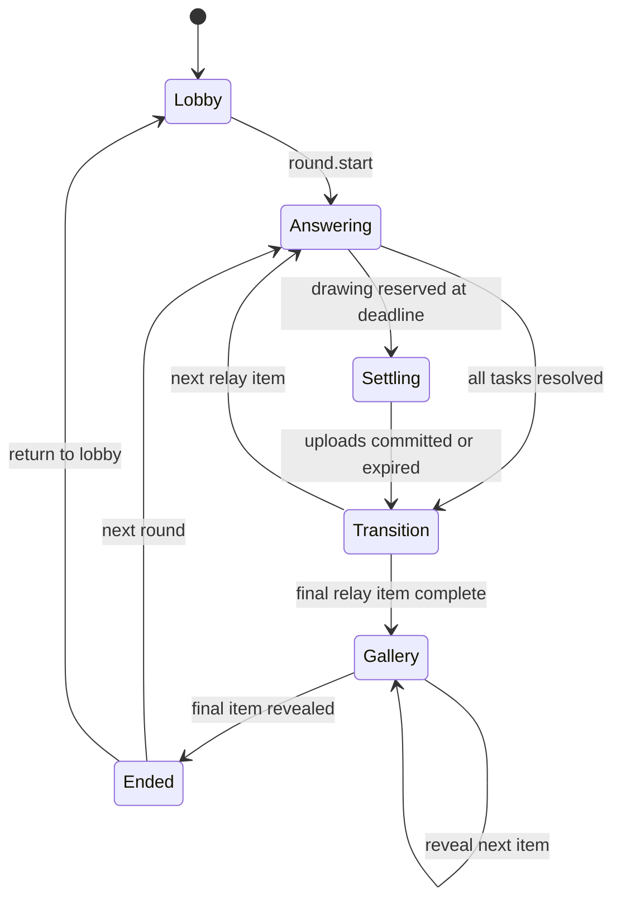

# 你画我猜接龙设计

> 状态：已确认的实现方案，尚未实现  
> 游戏 ID：`pictionary`  
> 展示名：你画我猜接龙  
> 最后更新：2026-09-05  
> 关联文档：[多游戏平台架构](./multigame-platform-design.md)

## 1. 目标

你画我猜接龙是第三个正式游戏。每位玩家先出一个题目，随后全员在“看文字作画”和“看画猜词”之间交替，最后逐条、逐项同步播放全部接龙结果。

本方案遵守现有平台边界：

- 服务端是游戏规则和阶段推进的唯一权威。
- `GameState` 是唯一权威状态，不建立客户端或 D1 的第二份游戏状态。
- 复用共享房间、座位、连接、重连、用户资料和分享基础设施。
- 游戏规则进入 `packages/game-engine`；Worker 负责认证、持久化、媒体和广播；客户端负责输入与展示。
- 画作二进制不进入 Durable Object 状态、SQLite 快照或 WebSocket 消息。

## 2. 已确认产品决策

| 项目     | 决策                                         |
| -------- | -------------------------------------------- |
| 玩家人数 | 默认 6 人，最少 4 人，最多 20 人             |
| 玩家类型 | V1 只允许真人，不提供机器人                  |
| 接龙长度 | 固定完整一圈，每条接龙包含 $N$ 个作品        |
| 出题时间 | 默认 15 秒                                   |
| 绘画时间 | 默认 120 秒                                  |
| 猜词时间 | 默认 15 秒                                   |
| 每棒等待 | 默认 5 秒                                    |
| 结果播放 | 默认每项 3 秒                                |
| 结果顺序 | 按接龙顺序，每条接龙从原题到最后一项逐个展示 |
| 计分     | V1 不计分、不投票、不评选                    |
| 画作形式 | 静态画作，不播放笔画过程                     |
| 中途加入 | 游戏开始后不能入座；原玩家可重连恢复任务     |

最多 20 人时共有 20 条接龙，每条 20 项，合计最多 400 个作品。其中绘画 200 幅、文字 200 条。

## 3. 核心玩法

### 3.1 一局流程

```text
大厅坐满
→ 全员出题
→ 每棒等待
→ 全员看文字作画
→ 每棒等待
→ 全员看画猜词
→ 继续交替，直到每条接龙经过所有玩家
→ 每棒等待
→ 同步结果播放
→ 自由回看
→ 下一局或返回大厅
```

每个作答阶段中，每位玩家只收到一个任务，也只能看到该任务的上一项内容。玩家不能提前看到接龙历史、其他玩家的输入或后续结果。

### 3.2 接龙分配

开始游戏时，服务端使用可注入随机源生成本局座位排列 $P$。排列和 `roundId` 一起写入权威状态，重启或重连不得重新随机。

第 $c$ 条接龙第 $s$ 项的作者为：

$$
author(c,s)=P[(c+s)\bmod N]
$$

其中：

- $N$ 为本局人数，范围为 4 至 20。
- $c$ 为接龙索引，范围为 $0$ 至 $N-1$。
- $s$ 为作品索引，范围为 $0$ 至 $N-1$。
- $s=0$ 是原始题目。
- $s>0$ 且为奇数时画画。
- $s>0$ 且为偶数时猜词。

这个分配保证：

- 每位玩家建立一条接龙。
- 每个阶段每位玩家恰好处理一条接龙。
- 每位玩家在同一条接龙中只出现一次。
- 每条接龙最终包含所有玩家的作品。

### 3.3 提交规则

- 文字提交后不可修改，首尾空白由服务端删除，空文本直接拒绝。
- 画作提交后不可修改；提交按钮会冻结当前画布并进入上传状态。
- 服务器按认证用户和权威座位确定作者，不接受客户端传入的作者座位。
- 命令必须包含 `roundId`、`phaseRevision` 和当前任务 ID；旧阶段请求明确拒绝。
- 当前阶段所有有效任务完成后，进入完整的“每棒等待”，不会跳过该等待。
- 时间结束仍未提交的任务生成明确的“本棒未提交”占位项，接龙继续。
- 下一位玩家看到占位项时仍可自由作画或猜词，不让一处缺席终止整条接龙。

## 4. 房间设置

配置页使用数值 stepper、预设选项和预计时长摘要。只有大厅阶段可以修改设置。

| 设置     | 默认值 | V1 可选值                             |
| -------- | -----: | ------------------------------------- |
| 玩家人数 |      6 | 4–20 的整数                           |
| 出题时间 |  15 秒 | 15 / 30 / 45 / 60 秒 / 不限时         |
| 绘画时间 | 120 秒 | 60 / 90 / 120 / 180 / 300 秒 / 不限时 |
| 猜词时间 |  15 秒 | 15 / 30 / 45 / 60 秒 / 不限时         |
| 每棒等待 |   5 秒 | 0 / 3 / 5 / 10 / 15 秒                |
| 结果播放 |   3 秒 | 每项 3 / 5 / 8 / 10 秒 / 手动         |

配置使用离散值而不是任意数字，避免无意义组合并让 Worker、engine 和客户端共享同一组常量。

缩小房间人数时遵循共享座位规则：目标范围外存在真人时拒绝；游戏已开始时所有配置更新都拒绝。

### 4.1 预计时长

设：

- $T_p$ 为出题时间。
- $T_d$ 为绘画时间。
- $T_g$ 为猜词时间。
- $T_w$ 为每棒等待时间。
- $T_r$ 为结果每项播放时间。

绘画阶段数和猜词阶段数分别为：

$$
D=\left\lceil\frac{N-1}{2}\right\rceil,\qquad
G=\left\lfloor\frac{N-1}{2}\right\rfloor
$$

全部阶段都用满时间时，一局最长预计时长为：

$$
T_{total}=T_p+D\times T_d+G\times T_g+N\times T_w+N^2\times T_r
$$

任一作答时间为“不限时”或结果为“手动”时，配置页显示“无法估算”，不制造虚假时长。

默认配置下：

- 6 人局约 9 分 3 秒。
- 20 人局约 44 分 10 秒，其中结果播放约 20 分钟。

实际作答阶段可因全员提前提交而缩短，固定等待和结果播放时间不缩短。

## 5. 状态机与计时



平台 lifecycle 映射：

| Pictionary phase                                    | Platform lifecycle |
| --------------------------------------------------- | ------------------ |
| `lobby`                                             | `setup`            |
| `answering` / `settling` / `transition` / `gallery` | `ongoing`          |
| `ended`                                             | `ended`            |

### 5.1 权威时间

- 权威状态保存绝对 `deadlineAt`，不保存“剩余秒数”。
- Worker 用服务端时间判断命令是否有效；客户端时间只用于显示。
- 任一在线客户端都可在 deadline 后请求推进，服务端只接受首个匹配当前 `phaseRevision` 的请求。
- 并发的过期推进是幂等操作：第一个请求推进状态，后续请求收到最新状态，不重复生成占位项。
- 重连恢复同一个 deadline，不重新获得完整作答时间。
- 全员离线时不让 Durable Object 空转；首个客户端重连后立即补推进已过期阶段。
- 补推进只结束当前过期阶段。下一阶段从实际推进时间开始，不能因离线过久一次跳完整局。
- 现有 DO alarm 继续专用于通用 effect outbox，本游戏不抢占 alarm。

### 5.2 不限时模式

- 不限时阶段的 `deadlineAt` 为 `null`。
- 全员提交后仍自动进入每棒等待。
- 房主可执行“结束本棒”，未提交任务生成占位项。
- 结束本棒必须二次确认，并由服务端再次校验房主身份和阶段。
- V1 不提供暂停作答；不限时已覆盖需要自由节奏的房间。

### 5.3 图片上传宽限

图片上传不能与阶段切换竞态，因此绘画提交分两步：

1. 玩家在 deadline 前发送 `drawing.reserve`，服务端冻结该任务并创建一次性 `submissionId`。
2. 客户端导出图片并在 15 秒上传窗口内完成上传。

阶段 deadline 到达时：

- 没有预留且未提交的任务立即记为未提交。
- 已预留的任务进入 `settling`，只等待现有上传，不接受新预留。
- 上传成功后提交媒体元数据；上传窗口到期则生成未提交占位项。
- 所有预留完成或过期后才进入每棒等待。

上传窗口是传输完成期限，不是额外作画时间。点击提交后画布立即只读。

## 6. 权威数据模型

以下是设计形状，最终实现名称以 engine 中的领域类型为准。

```ts
interface PictionaryConfig {
  readonly numberOfPlayers: number;
  readonly promptDurationSeconds: 15 | 30 | 45 | 60 | null;
  readonly drawingDurationSeconds: 60 | 90 | 120 | 180 | 300 | null;
  readonly guessDurationSeconds: 15 | 30 | 45 | 60 | null;
  readonly transitionDurationSeconds: 0 | 3 | 5 | 10 | 15;
  readonly galleryItemDurationSeconds: 3 | 5 | 8 | 10 | null;
}

type PictionaryEntry =
  | {
      readonly kind: 'text';
      readonly id: string;
      readonly authorSeat: number;
      readonly text: string;
      readonly submittedAt: number;
    }
  | {
      readonly kind: 'drawing';
      readonly id: string;
      readonly authorSeat: number;
      readonly media: PictionaryMedia;
      readonly submittedAt: number;
    }
  | {
      readonly kind: 'missed';
      readonly id: string;
      readonly authorSeat: number;
      readonly expectedKind: 'text' | 'drawing';
    };

interface PictionaryMedia {
  readonly objectKey: string;
  readonly contentType: 'image/png';
  readonly width: 1024;
  readonly height: 768;
  readonly byteLength: number;
  readonly sha256: string;
}

interface PictionaryChain {
  readonly id: string;
  readonly originSeat: number;
  readonly entries: readonly PictionaryEntry[];
}
```

`PictionaryState` 还保存：

- `stateVersion`、`roomCode`、`hostUserId` 和共享座位状态。
- `config`、`roundId` 和当前轮次编号。
- 长度恰好为 $N$ 的 `seatOrder`。
- 当前 discriminated `phase` 和单调递增的 `phaseRevision`。
- 当前图片上传预留；每个座位最多一个。
- $N$ 条接龙及已接受作品。
- 画廊的 `chainIndex`、`entryIndex`、播放状态和 deadline。

不保存：

- PNG、base64 或其他图片字节。
- 本地笔画、撤销栈或未提交草稿。
- 可从接龙条目推导出的第二份“已提交座位”集合。
- $N\times N$ 的任务分配矩阵；任务由公式计算。

20 人上限使状态中最多只有 400 个轻量条目和 20 个临时上传预留。Codec 必须精确验证数组长度、作者分配、条目奇偶类型、游标范围、媒体字段和阶段不变量；损坏状态直接失败，不猜测修复。

## 7. 命令与权限

### 7.1 Public commands

- `pictionary.config.update`
- `pictionary.round.start`
- `pictionary.text.submit`
- `pictionary.drawing.reserve`
- `pictionary.phase.expire`
- `pictionary.phase.finish`
- `pictionary.gallery.pause`
- `pictionary.gallery.resume`
- `pictionary.gallery.advance`
- `pictionary.gallery.rewind`
- `pictionary.round.next`
- `pictionary.game.returnToLobby`

共享入座、离座、踢人和房间操作继续使用平台命令，不复制 Pictionary 版本。

### 7.2 Internal commands

- `pictionary.drawing.commit`
- `pictionary.upload.expire`

`drawing.commit` 只能由已认证的游戏媒体 HTTP 路由构造。公开命令 schema 不接受 R2 object key，防止客户端伪造其他房间的媒体引用。

### 7.3 权限矩阵

| 操作                           | 权限                                           |
| ------------------------------ | ---------------------------------------------- |
| 修改配置、开始、结束不限时阶段 | 房主，且阶段合法                               |
| 提交文字、预留图片             | 当前任务对应的已入座用户                       |
| 提交图片元数据                 | Worker 内部媒体路由                            |
| 请求 deadline 推进             | 任一已认证房间成员                             |
| 暂停、恢复、前进、后退结果     | 房主                                           |
| 下一局、返回大厅               | 房主                                           |
| 自由回看                       | 结果结束后的所有房间成员，本地游标不改权威状态 |

房主只是 UI 和权限标记。所有命令仍在同一个 Worker/DO 权威路径完成 read-compute-write-broadcast。

## 8. 媒体存储与 API

### 8.1 R2

- 新增私有 `GAME_MEDIA` R2 bucket，不复用名为 `AVATARS` 的现有桶。
- 对 `pictionary/` 前缀配置 48 小时生命周期。
- object key 由服务端生成，包含 `creationId`、`roundId` 和 `submissionId`，不只使用可复用的房间号。
- R2 对象不可变；重试使用同一 `submissionId` 和摘要，内容冲突直接拒绝。
- DO 状态只保存已接受对象的 key 和元数据。
- 被拒绝或超时的上传立即尝试删除；删除失败必须记录并上报，生命周期负责最终清理。

对象路径示意：

```text
pictionary/{creationId}/{roundId}/{submissionId}.png
```

### 8.2 上传接口

```text
PUT /api/games/pictionary/rooms/:roomCode/submissions/:submissionId
Content-Type: image/png
```

请求体直接传二进制，不使用 base64 或现有公开分享接口。处理顺序：

1. 验证登录态、房间成员身份和请求大小。
2. 向目标 DO 验证 `submissionId` 仍属于该用户的当前上传预留。
3. 校验 PNG 文件签名、解码尺寸、固定 4:3 比例和大小上限。
4. 流式写入 `GAME_MEDIA`。
5. 计算并保存字节数、SHA-256 和 R2 object key。
6. 通过现有原子命令管线提交 `pictionary.drawing.commit`。
7. 返回最新命令结果；不能把“上传成功”误报为“作品已接受”。

V1 画作规格固定为 1024×768 PNG，单文件最大 2 MiB。SVG、动画图片和客户端提供的 object key 一律拒绝。

### 8.3 读取接口

```text
GET /api/games/pictionary/rooms/:roomCode/media/:entryId
```

读取接口必须：

- 验证登录态与房间成员身份。
- 让 DO 根据 `entryId` 找到权威 object key，不接受路径形式的 key。
- 作答中只允许读取当前任务需要看到的上一项画作。
- 结果阶段允许读取已完成轮次的画作，支持预取下一项。
- 返回 `ETag`、明确的私有缓存策略和 `X-Content-Type-Options: nosniff`。
- R2 对象缺失时返回明确错误，不用空白图片掩盖数据损坏。

### 8.4 保留与隐私

- 画作和题目属于用户生成内容，不写入日志、Sentry breadcrumb 或分析事件。
- 房间元数据继续遵循现有 24 小时清理；R2 使用 48 小时保留，为重连和清理延迟留出余量。
- 上线前更新隐私说明，明确临时画作的用途与保留时间。
- V1 房间内容不公开索引，不提供永久作品库。

## 9. 客户端体验

### 9.1 配置与大厅

- 首页通过 client game catalog 显示“你画我猜接龙”。
- 配置页展示所有 6 项设置及预计总作品数、绘画数、文字数和最长预计时长。
- 房间沿用共享 `RoomShell`、座位、头像、分享、房间号与连接状态。
- 开始按钮只在 4–20 个真人全部入座时启用，并明确显示缺少人数。
- 游戏开始后锁定座位，不允许换座、踢人或新增玩家。

### 9.2 文字作答

- 顶部显示当前阶段、作品序号和服务端倒计时。
- 中部只显示当前任务所需的文字或画作。
- 输入限制和剩余字数在客户端与 Worker 使用同一常量。
- 提交后显示“已提交，等待其他玩家”及完成数，不显示他人内容。
- 超时后输入立即只读，并等待服务端快照确认阶段结果。

### 9.3 画布

使用现有 `@shopify/react-native-skia` 能力实现跨 Web、iOS、Android 的固定 4:3 画布，并先完成导出一致性 spike。不要以 DOM/SVG 字符串作为权威画作格式。

V1 工具：

- 画笔与橡皮擦。
- 有限颜色色板。
- 三档笔宽。
- 撤销、重做和清空确认。
- 提交按钮与上传进度。

本地绘图模型使用归一化坐标，保证不同屏幕上显示一致。笔画和撤销栈只存在本机，并按 `roomCode + roundId + taskId` 临时保存；服务器只接收最终 PNG。任务完成、过期或离开房间后删除草稿。

工具栏使用图标按钮、明确的无障碍名称和 tooltip。画布尺寸使用稳定 `aspect-ratio`，键盘、倒计时或错误文案不得挤压画布或遮挡提交按钮。

### 9.4 每棒等待

等待页持续完整的配置时长，并显示：

- 下一棒类型。
- 当前棒已提交人数与未提交人数。
- 进入下一棒的倒计时。

不显示任何作品预览，避免提前泄露。

### 9.5 同步结果播放

- 所有设备使用权威 `chainIndex`、`entryIndex` 和 deadline 展示相同内容。
- 每条接龙先显示原题，再按顺序显示画作、猜词和占位项。
- 每项揭晓后才显示该项作者头像和名字。
- 自动模式默认每项停留 3 秒；手动模式由房主前进。
- 房主可暂停、继续、前进和后退；每次操作都经服务端广播。
- 切换接龙时显示简短标题，不额外计为一个作品播放项。
- 最后一项播放后进入 `ended`，所有玩家可用本地游标自由回看，不再互相抢进度。

## 10. 断线与异常规则

| 场景                 | 权威行为                             | 客户端反馈                          |
| -------------------- | ------------------------------------ | ----------------------------------- |
| 作答者短暂断线       | 座位与任务保留，deadline 不重置      | 重连后恢复当前任务和剩余时间        |
| 作答者超时未提交     | 写入 `missed` 占位项                 | “本棒未提交，接龙将继续”            |
| 图片预留后上传失败   | 可在上传窗口内重试；到期写入占位项   | 明确重试或超时结果                  |
| 上传完成但阶段已失效 | DO 拒绝 commit，对象进入清理         | “本棒已结束，画作未提交”            |
| 重复提交             | 相同幂等键返回既有结果；不同内容拒绝 | 保持已提交状态                      |
| 房主断线             | 游戏继续，其他客户端可触发到点推进   | 不转移权威时间，不暂停全局          |
| 全员离线             | 不推进；首个重连者补推进当前过期阶段 | 进入最近的下一合法阶段              |
| 结果图片读取失败     | 保持当前结果项，可重试或由房主跳过   | “画作加载失败，请重试”              |
| R2 不可用            | 不接受画作提交，不写入悬空状态引用   | 中文错误并允许在期限内重试          |
| DO 状态损坏          | Codec fail fast，禁止猜测恢复        | 记录错误、Sentry 上报、显示房间异常 |

关键异常遵循现有三层处理：项目 logger、Sentry 和具体中文 UI 反馈。预期的过期、重复和权限拒绝使用 warning 与用户反馈，不上报为系统故障。

## 11. 架构接入

### 11.1 Game engine

新增 `packages/game-engine/src/games/pictionary/`，按 FibKing 的模块边界组织：

- `state/`：状态类型、严格 codec、normalize 与派生查询。
- `commands/`：配置、开局、提交、超时、结果控制和下一局。
- `domain/`：分配公式、阶段计算、条目不变量和时间常量。
- `effects/`：只声明确有外部副作用的 effect；R2 字节不进入 engine。
- `engine.ts`、`public.ts`、`publicStats.ts`。

同时：

- 将 `pictionary` 加入 `GAME_TYPES` 和 engine catalog。
- 把现有 compile-only Pictionary fixture 改成中性未注册游戏名，保留第三方模块类型门禁。
- 所有时间选项、人数范围、文本长度和媒体元数据限制从 game-engine public exports 复用。

### 11.2 API Worker

新增 `packages/api-worker/src/games/pictionary/`：

- `module.ts`：Worker game module 和游戏 HTTP routes。
- `schemas.ts`：create config、public/internal command 和 effect schema。
- `mediaRoutes.ts`：认证上传与读取。
- `mediaValidation.ts`：文件签名、尺寸、大小和摘要。
- `dbSchema.ts`：若该游戏需要 DO SQLite 表，只在本模块声明。

平台改动仅限组合与基础设施：

- Worker game catalog 注册新模块。
- D1 migration 允许 `pictionary` room type。
- `Env` 和生产、测试、E2E Wrangler 配置加入 `GAME_MEDIA` binding。
- 部署步骤创建 bucket，并配置 `pictionary/` 生命周期规则。

V1 不新增 D1 作品表。游戏权威状态保存在 DO SQLite，R2 保存图片，避免 DO、D1 双写。

### 11.3 Client

新增 `src/games/pictionary/`：

- `module.ts`：client game module。
- `home/`：首页卡片贡献。
- `navigation/`：配置、规则和房间内页面导航。
- `screens/`：配置、规则、作答、等待、结果和自由回看。
- `room/`：共享房间 shell adapter 与阶段 action。
- `runtime/`：命令、deadline 和重连协调。
- `services/`：画布导出、草稿存储、媒体上传与读取。

第三游戏接入不应在 `GameRoom.ts`、`HomeScreen.tsx`、`AppNavigator.tsx`、`RoomShell.tsx` 或 Worker `actionPipeline.ts` 中增加 `if (gameType === 'pictionary')`。缺少的共享能力必须先证明对多个游戏通用，再进入平台层。

## 12. 安全、容量与可观测性

### 12.1 安全边界

- 所有 JSON 和 URL 参数由 Zod 严格解析。
- 上传路由要求认证、房间成员、当前任务和有效预留四项同时成立。
- 不信任客户端 MIME、尺寸、文件名、object key、作者座位或时间戳。
- 图片只允许 PNG，校验文件签名和解码后的真实尺寸。
- 文本拒绝控制字符并限制 grapheme 数，不按 UTF-16 code unit 截断中文或 emoji。
- 媒体桶保持私有；读取始终经过授权路由。
- 日志不包含题目、猜词、图片内容、访问令牌或完整 object key。

### 12.2 容量边界

- 房间人数最多 20。
- 每局最多 400 个状态条目。
- 每个绘画阶段最多 20 个并发上传。
- 每局最多 200 幅 PNG；按 2 MiB 硬上限计算，极端上限为 400 MiB。
- 客户端结果页只解码当前图片并预取下一张，不一次加载 200 张图片。
- WebSocket 只广播状态和媒体元数据，不广播图片字节。

### 12.3 指标与日志

记录不含用户内容的结构化数据：

- 阶段类型、人数、阶段实际耗时和推进延迟。
- 提交、超时、图片预留、上传成功、上传失败和过期数量。
- 图片字节数与上传延迟分布。
- stale command、重复命令和权限拒绝数量。
- R2 读取失败、孤儿删除失败和结果播放推进延迟。

## 13. 测试方案

### 13.1 Engine tests

- 4、6、20 人 initial state；3 和 21 人拒绝。
- 分配公式在 4–20 人下保证每阶段每人一个任务、每条接龙作者不重复。
- 奇数项绘画、偶数项猜词，最终每条长度恰好为 $N$。
- 全员提前提交、部分超时、全部超时和不限时房主结束。
- 图片预留、上传窗口、commit、过期和 stale `phaseRevision`。
- 每棒等待不会因提前提交被跳过。
- 结果自动播放、手动播放、暂停、前进、后退和最终结束。
- 重复命令幂等，越权和跨轮次命令拒绝。
- Normalize 对损坏排列、条目、游标、媒体和阶段组合 fail fast。
- 生命周期映射与下一局清理。

### 13.2 Worker/DO tests

- create/config schema 接受 4 和 20，拒绝 3、21、非法时间选项和额外字段。
- 认证用户到座位的映射，不能伪造作者。
- R2 上传的 MIME、签名、尺寸、大小、摘要和 object key。
- 预留前上传、跨房间上传、过期上传和重复上传均拒绝。
- R2 写成功但 commit 失败时执行清理；清理失败进入可观测终态。
- 同时收到多个 `phase.expire` 时只推进一次。
- DO 重启后 round、deadline、预留和画廊游标恢复一致。
- 媒体读取在当前任务、结果阶段和未授权场景下的权限矩阵。
- 20 人同阶段上传不会把图片字节写入快照或广播。

### 13.3 Client tests

- 配置默认值、离散选项、预计时长和 4/20 边界。
- 当前玩家任务选择器不会展示错误接龙或未来内容。
- 倒计时由绝对 deadline 派生，重渲染和重连不重置。
- 画布 reducer 的画笔、橡皮擦、撤销、重做、清空和冻结。
- 草稿只按当前任务恢复，任务结束后删除。
- 上传状态、重试、超时和中文错误反馈。
- 结果播放器跟随权威游标；ended 后改用本地回看游标。

### 13.4 E2E

至少覆盖：

1. 4 个真实浏览器完成一整局，验证出题、画画、猜词和逐项结果。
2. 一名玩家超时，其他接龙继续并在结果中显示占位项。
3. 绘画上传期间跨过 deadline，已预留上传仍可在窗口内提交。
4. 作答中断线重连，任务和倒计时不重置。
5. 结果自动按每项 3 秒推进，房主暂停与恢复同步到所有设备。
6. 配置页接受 20、拒绝 21；20 人房间能创建并显示全部座位。
7. 320px mobile 和 desktop 的配置、画布、等待、结果截图无重叠或裁切。

完整 20 人接龙的组合正确性由 engine/Worker 测试覆盖，不启动 20 个浏览器重复验证同一规则。

## 14. 实施顺序

### Phase 1：领域契约

- 固定配置常量、状态、命令、事件、分配公式和 codec。
- 完成 engine 单测。
- 重命名 compile-only Pictionary fixture。

退出条件：4–20 人完整一圈及所有阶段转换可由纯 engine 证明。

### Phase 2：Worker 与媒体基础设施

- 注册 Worker module 和严格 schema。
- 加入 D1 game type migration。
- 建立 `GAME_MEDIA` binding、bucket 和生命周期。
- 完成预留、上传、commit、读取和清理测试。

退出条件：真实 DO + R2 测试证明状态与对象不会出现悬空成功。

### Phase 3：客户端作答

- 注册 client module、首页、配置、规则和 room adapter。
- 完成文字任务、Skia 画布、本地草稿、上传和等待页。
- 验证 Web、iOS、Android 的 1024×768 PNG 导出一致性。

退出条件：多端可完成一轮文字和绘画提交，断线恢复不重置时间。

### Phase 4：结果与完整流程

- 完成同步自动播放、手动控制、自由回看和下一局。
- 增加 4 人完整 E2E、超时、上传竞态和重连场景。
- 完成 desktop/mobile 视觉检查。

退出条件：从建房到下一局的完整纵向流程通过。

### Phase 5：上线

- 更新部署脚本、隐私说明、运维指标和告警。
- 运行 `pnpm run quality` 与完整 E2E。
- 生产验证 R2 生命周期和私有读取。
- 最后才在生产 catalog 暴露入口，避免合入半成品游戏。

## 15. 验收标准

功能完成必须同时满足：

- 4–20 人建房、入座、开始和下一局行为一致。
- 默认值为出题 15 秒、绘画 120 秒、猜词 15 秒、每棒等待 5 秒、结果每项 3 秒。
- 每条接龙包含 $N$ 名不同玩家的 $N$ 个作品，最多 400 项。
- 所有设备的阶段、倒计时和结果播放一致。
- 断线、超时、重复请求和图片上传竞态都有唯一明确终态。
- DO、SQLite 和 WebSocket 中不存在图片字节。
- 任何客户端都不能通过公开 command 注入 R2 object key 或作者座位。
- 20 人边界在 engine、Worker、客户端和 E2E 均有对应证据。
- Web、iOS、Android 和 320px Web viewport 均可完成核心流程。
- `pnpm run quality` 和目标 E2E 全部通过。
