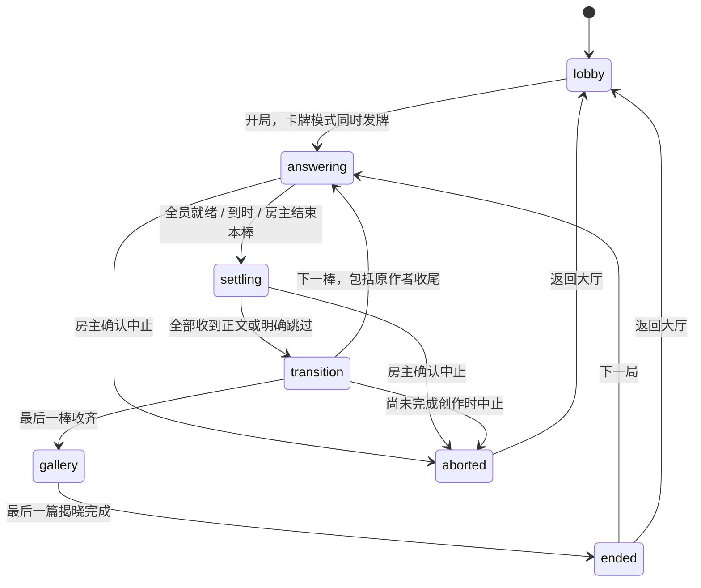

# 故事接龙游戏设计

> 状态：设计待评审，尚未实现；本次只交付文档，不授权后续代码修改。  
> 最后更新：2026-09-22  
> 展示名：故事接龙  
> 建议游戏 ID：`storyrelay`，实现前按仓库命名规则复核并注册。  
> 关联：[房间界面契约](./room-shell-contract.md)、[视觉基准](./DESIGN.md)、[新增游戏接入清单](./multigame-platform-design.md#25-新增游戏接入清单)、[你画我猜接龙](./pictionary-game-design.md)、[谁是卧底](./undercover-game-design.md)。

## 1. 定位与决策边界

保留你画我猜接龙的「全员同时作答、多条接龙并行、最终集体揭晓」，提供纯故事接龙和卡牌故事接龙两种模式。不是文字传话，也不是《Once Upon a Time》的线上复刻。

每人开一篇故事，其他玩家依次续写，最后回到原作者收尾。卡牌模式看完整前文，使用开头卡、元素牌和秘密结局；纯故事模式只看上一棒文字，更早内容隐藏，开头、续写和结尾全部自己写，没有任何卡牌约束。全程输入文字，不口述、不录音、不绘画；续写新剧情，不要求复述上一段。

### 1.1 已确认方向

- 独立新增一个游戏，不在你画我猜里加入新模式。
- 同一游戏在配置页通过「启用故事卡牌」开关选择模式，默认关闭，即普通的纯故事接龙；可手动开启卡牌模式，不增加第二个首页游戏入口。
- 每人同时开启一篇故事，每棒全员同时写作。
- 纯故事模式续写和收尾都只看上一棒文字，更早内容隐藏，直到最终回放才逐段揭晓全文；卡牌模式能看当前故事完整前文，但不能看原作者的秘密结局。
- 卡牌模式由开头卡提供情境、元素牌提供每棒素材、秘密结局提供收尾目标；纯故事模式全部自由创作。
- 两种模式均由原作者额外写一棒结尾，最后逐篇、逐段揭晓作者和正文；卡牌模式同时揭晓对应卡牌，可自由阅读完整故事。
- 不抢话、不要求用完手牌、不设胜负或评分，不使用 AI 判定合理性。
- 对齐其他游戏的房间系统，包含机器人测试能力。

### 1.2 本稿确定的推荐参数

以下人数、时间、手牌数量、牌库规模、奖励规则和缺席处理是为了形成完整方案给出的默认设计，并非用户已逐项确认。开发前整体评审本稿；不要把「文档已写好」标成「功能已实现」。

### 1.3 灵感与内容边界

[Atlas Games 官方介绍](https://atlas-games.com/onceuponatime/)中的《Once Upon a Time》使用故事元素、隐藏结局及讲述权交接。本游戏只借鉴「元素约束＋秘密结局」的创作形式，不采用其打断、出完手牌获胜等规则。

牌面文案、示例和视觉资产全部原创，不复制商业游戏牌库、规则全文、插画或品牌包装，不以官方改编名义发布。

## 2. 现有非狼人杀游戏系统核对

以下以 2026-09-22 读取的源码为依据，历史设计稿与源码冲突时以源码为准。

| 系统                                       | 已有证据                                                                                          | 故事接龙决策                                                 |
| ------------------------------------------ | ------------------------------------------------------------------------------------------------- | ------------------------------------------------------------ |
| 大厅入座、换座、离座、移出、清空、补机器人 | 三个游戏的 room adapter 均调用 `createRoomSetupCapabilities`；共享 `RoomSeatCommand` 提供基础命令 | 复用共享模型与座位内核，不复制管理 UI                        |
| 房主接管机器人                             | 瞎掰王在 `ongoing`；你画我猜在 `answering/settling`；卧底在 `reading/ongoing` 开放                | 在写作、收稿阶段开放，工作区提供明确的机器人切换入口         |
| 机器人实现差异                             | 瞎掰王、你画我猜使用补位开关与排除席位；卧底使用 `botSeats`，并有清除机器人命令                   | 本游戏采用显式 `botSeats`，不要求已有游戏迁移                |
| 机器人批量操作                             | 卧底有 `undercover.round.markAllBotsViewed`                                                       | 不照搬成批量虚构故事；只增加明确的批量跳过未交机器人操作     |
| 私密信息展示                               | 卧底词卡由游戏 UI 控制可见；共享资料模型只投影公开信息                                            | 手牌、秘密结局不进入普通资料、邀请、公共摘要或无障碍标签     |
| 作答与统一收稿                             | 你画我猜的 ready、settling、任务级本地草稿与 finalizer                                            | 沿用契约，不直接 import 你画我猜模块                         |
| 服务端随机分配                             | 你画我猜开局持久化 `seatOrder`、`stepOffsets`                                                     | 使用同样的轮转分配规则，另加回原作者的收尾棒                 |
| 回放                                       | 你画我猜有暂停、恢复、前进、后退及结束后的自由回看                                                | 新游戏默认手动揭晓，支持可选自动播放                         |
| 准备失败与中止                             | 卧底有重试、准备失败和 `aborted`；瞎掰王有取消准备                                                | 本游戏首版使用内置牌库，不引入异步准备阶段；保留明确中止终态 |
| 成长与抽奖                                 | 当前 `settleGameRewards` 的 completion 策略只列出 `fibking/pictionary`                            | 新游戏需要显式新增产品奖励策略；不能假定注册游戏就自动发奖   |
| 连接、邀请、头像外观、账户事件             | 共享 `RoomShell`、房间 session 和账户系统                                                         | 复用；不另建房间连接、账号或抽奖系统                         |

主要代码参考：

- [瞎掰王房间能力](../src/games/fibking/room/fibRoomAdapter.ts)。当前源码展示名为「瞎掰王」。
- [你画我猜房间能力](../src/games/pictionary/room/pictionaryRoomAdapter.ts)、[命令](../packages/game-engine/src/games/pictionary/commands/types.ts)、[引擎](../packages/game-engine/src/games/pictionary/engine.ts)、[草稿收取](../src/games/pictionary/room/hooks/usePictionaryDraftFinalizer.ts)。
- [卧底房间能力](../src/games/undercover/room/undercoverRoomAdapter.ts)、[命令](../packages/game-engine/src/games/undercover/commands/types.ts)。
- [共享座位命令](../packages/game-engine/src/platform/protocol/commands.ts)、[产品奖励结算](../packages/api-worker/src/features/account/settleGameRewards.ts)。

## 3. 人数、棒数与完整流程

### 3.1 规则参数

| 项目           | 首版设计                                                         |
| -------------- | ---------------------------------------------------------------- |
| 人数           | 4–20，默认 6；真人与机器人合计                                   |
| 故事数量       | 与人数相同，每席发起一篇                                         |
| 普通棒         | 共 N 棒：开头 1 棒，其他玩家续写 N−1 棒                          |
| 收尾棒         | 额外 1 棒，回原作者收尾                                          |
| 每篇总段数     | N＋1，包括明确的跳过占位                                         |
| 每位玩家任务数 | N＋1：自己开头、续写其他 N−1 篇、自己收尾                        |
| 文字长度       | 每段最多 512 个 UTF-16 code units；保留换行和原始空格            |
| 普通棒用牌     | 卡牌模式一段选一张元素牌，开头另有开头卡；纯故事模式不用牌       |
| 收尾用牌       | 卡牌模式使用本人的秘密结局牌；纯故事模式自由收尾；均不消耗元素牌 |
| 计分           | 无获胜方、无排名、无投票                                         |

6 人示例：6 篇故事，每篇「开头＋4 位玩家续写＋最后 1 位玩家续写＋原作者结尾」，共 7 棒、42 段。20 人共 21 棒、420 段。

### 3.2 一局流程

```text
建房与配置 → 入座 / 补机器人 → 房主开始
→ 同一次权威提交：锁定名单与模式、分配任务顺序；仅卡牌模式发开头卡、手牌与秘密结局
→ 全员写开头 → 统一收稿 → 棒间等待
→ 全员续写：纯故事模式只看上一棒；卡牌模式看全文并选元素牌 → 统一收稿 → 棒间等待
→ 重复，直到每人参与每篇故事一次
→ 故事回原作者，全员写结尾 → 统一收稿 → 棒间等待
→ 逐篇、逐段同步揭晓 → 自由回看 / 复制全文
→ 下一局，或返回大厅调整配置
```

这是「并行写作、每棒同步」，不是完全不用等待：提前完成的人仍需等待本棒全部稿件收齐或明确跳过，再统一换故事。

不额外设置「全员看牌确认」阶段；卡牌模式进入开头任务后可查看开头卡、自己的手牌和秘密结局；纯故事模式直接进入空白输入区，不提供自动开头或隐藏结局目标。

### 3.3 两种模式对照

| 环节       | 纯故事接龙（默认关闭卡牌）                          | 卡牌故事接龙（手动开启）                     |
| ---------- | --------------------------------------------------- | -------------------------------------------- |
| 开头       | 完全自己写                                          | 根据开头卡情境，选一张元素牌写作             |
| 续写       | 只看上一棒文字，更早内容隐藏，自由续写              | 看完整前文和开头卡，选一张元素牌续写         |
| 收尾       | 回到原作者，仍只看上一棒文字，自由写结尾            | 回到原作者，看全文将剧情接到秘密结局         |
| 卡牌资源   | 不发牌、不保存牌序、不依赖牌库库存                  | 开头卡、5 张初始元素手牌、秘密结局           |
| 回放与复制 | 正文、作者、跳过记录                                | 另含开头卡、使用的元素牌和末尾揭晓的秘密结局 |
| 共同系统   | N＋1 棒、统一收稿、机器人、恢复、奖励、最终全文回看 | 与纯故事模式相同                             |

### 3.4 分配算法与不变量

沿用现有接龙的 Williams 首行偏移构造。设随机座位排列为 P，普通棒偏移为 O＝[0, 1, N−1, 2, N−2, …]，截取 N 项。第 c 篇故事第 s 棒作者为 `P[(c + O[s]) % N]`。收尾棒单独使用 `P[c]`，等价于额外追加偏移 0。

- 开局一次生成并持久化 `seatOrder`、`stepOffsets`；重连和部署恢复不能重新洗牌。
- 普通棒偏移是 0 至 N−1 的排列；收尾偏移固定为 0。
- 每个阶段每席恰好一项任务；每篇普通棒作者不重复；只有原作者额外收尾。
- 偶数人数普通棒的交接对象均衡；奇数人数不承诺完整 Williams 平衡设计。
- 故事顺序固定为开局的 chain 顺序；跳过、离线和机器人不会重新分配故事。
- 原作者在收尾前不能随时打开自己的故事看进展，只能看当前分配的故事。
- 纯故事模式第 s 棒只投影同一篇的第 s−1 项，首棒无前文；收尾也不例外，不额外展示本人最初写的开头。不回溯查找最近的非空段落，不提供历史段落入口。

## 4. 卡牌系统

本节仅适用于「启用故事卡牌」开启时。纯故事模式不创建手牌、开头卡或秘密结局，不渲染卡牌占位，也不执行抽牌、扣牌与补牌逻辑。

### 4.1 首版牌库

采用随应用发布的原创静态牌库，不接生成模型，不建在线供词流水线，不需要额外牌库数据库或外部请求。

| 类型     | 数量 | 设计要求                                         |
| -------- | ---: | ------------------------------------------------ |
| 人物     |   24 | 职业、身份或人物关系，不预设固定主角             |
| 地点     |   24 | 能容纳多种题材的场所                             |
| 物品     |   24 | 可推动剧情，不要求特定世界观                     |
| 事件     |   24 | 变化或冲突，而不是完整结局                       |
| 特征     |   24 | 性格、状态或属性                                 |
| 开头情境 |   40 | 具体、有悬念、容易动笔，不预写完整故事或限定结局 |
| 秘密结局 |   40 | 有明确收束方向，留出人物和因果发挥空间           |

合计 120 张元素牌、40 张开头卡、40 张结局牌，共 200 张，作为原创基础内容的最低门槛，不再作为包含全部扩展后的总量上限。扩展覆盖范围见下表；最终原创牌库数量须在内容制作、去重与验收后统计，本设计文档不声称牌库已完成。

- 元素牌至少包含稳定 ID、类别、中文标题和简短释义；开头卡包含稳定 ID、中文情境；结局牌包含稳定 ID、中文目标。
- 一套混合题材牌库，全部扩展题材纳入首版内容规划并混合抽取，不增加主题选择开关、稀有度、付费抽牌或自定义卡牌。
- 元素类别只是创作类型，不决定分数，也不限制某个阶段必须使用哪类牌。
- 不把元素牌接入产品抽奖背包；游戏用牌与装扮收藏是两种独立概念。
- 原创示例：物品「打不开的信」、地点「末班车站」、事件「所有钟停了」。结局示例：「大家终于明白，寻找的东西一直就在身边。」

#### 全部扩展覆盖范围

按 2026-09-22 核对的 Atlas Games 官方产品页，将第三版基础包及六个内容扩展全部纳入设计参考和题材覆盖范围，不只选择其中部分扩展。下列中文为题材说明，不宣称是官方译名。

| 官方产品                                                            | 题材方向                     | 原版故事牌 | 原版结局牌 | 官方清单入口                                                                              |
| ------------------------------------------------------------------- | ---------------------------- | ---------: | ---------: | ----------------------------------------------------------------------------------------- |
| [第三版基础包](https://atlas-games.com/product_tables/AG1030)       | 通用童话                     |        114 |         51 | [基础包清单](https://atlas-games.com/pdf_storage/OUAT3CoreCardlistWEB.pdf)                |
| [Enchanting Tales](https://atlas-games.com/product_tables/AG1032)   | 魔法、公主与奇遇             |         38 |         17 | [扩展清单](https://www.atlas-games.com/pdf_storage/EnchantingCardlistWEB.pdf)             |
| [Seafaring Tales](https://atlas-games.com/product_tables/AG1033)    | 航海、海盗与寻宝             |         38 |         17 | [扩展清单](https://www.atlas-games.com/pdf_storage/SeafaringCardlistWEB.pdf)              |
| [Knightly Tales](https://atlas-games.com/product_tables/AG1034)     | 骑士与冒险                   |         38 |         17 | [扩展清单](https://www.atlas-games.com/pdf_storage/KnightlyCardlistWEB.pdf)               |
| [Animal Tales](https://atlas-games.com/product_tables/AG1035)       | 动物寓言                     |         38 |         17 | [扩展清单](https://drive.google.com/open?id=1igKSsrdKPe_-LMEArv4a_ARDYB5lMd_ABr3MyXxXls4) |
| [Fairy Tales](https://atlas-games.com/product_tables/AG1036)        | 精灵与魔法生灵               |         38 |         17 | [扩展清单](https://drive.google.com/open?id=1VVSg6-Clsxqfhb2vL_zw6dsMCQhq3CNfuVkmM4oiDYE) |
| [Fairytale Mash-ups](https://atlas-games.com/product_tables/AG1037) | 经典童话角色与情境混搭       |         38 |         17 | [扩展清单](https://atlas-games.com/pdf_storage/FairytaleMash-upsCardList.pdf)             |
| **第三版合计**                                                      | **基础包及全部六个内容扩展** |    **342** |    **153** | **495 张**                                                                                |

- 表中数量是官方产品的卡牌张数，不是已制作的应用库存，也不代表跨包去重后的独立概念数。已核对产品页数量和清单入口，尚未逐张核对清单正文。
- [第二版 Dark Tales](https://atlas-games.com/ouatlegacy) 另有 56 张牌及[官方清单](https://www.atlas-games.com/pdf_storage/Dark%20Tales%20Card%20List.rtf)，单独纳入历史扩展参考，不混入第三版 495 张统计；其分类型数量和跨版本重复内容待核对。
- Create-Your-Own Storytelling Cards 是空白自制卡，Writer's Handbook 是写作手册，都不计入固定卡面内容库存，也不因此新增自定义卡牌功能。
- 本项目的独立开头情境卡是新增设计，不能把原版故事牌或结局牌张数当成开头卡数量。
- 全部扩展的题材覆盖不等于整套商业卡面获准使用。当前继续采用原创中文内容，不整套复制、翻译原版卡面或搬用美术；直接收录原版素材须先确认相应授权。公开清单仅作为设计研究来源。
- 扩展只增加创作素材，不引入原版抢话、打断或胜负机制；仍遵循每棒一张元素牌、原作者额外收尾的既定规则。纯故事模式不受扩展影响。
- 内容验收需逐项检查六个扩展题材均有实际可抽取的原创内容，并检查混搭可写性；仅记录扩展名称或链接不能视为牌库交付完成。

### 4.2 开头卡

- 每篇开局分配一张，同局不同篇不重复，绑定故事而非跟随当前写作者；不占元素手牌的 5 张额度。
- 开头卡和结局卡独立随机分配，不强制题材匹配。结局避免依赖指定人物或物品，保证组合有发挥空间。
- 原作者根据情境，再选一张元素牌写第一段；不要求逐字照抄开头卡，系统不判定语义匹配。
- 示例情境：「今天早上，你发现所有人都在为一件你没做过的事感谢你。」
- 开头阶段仅原作者可见本篇开头卡；本棒收齐进入后续续写后，接到该篇的玩家能看到它和完整前文，不能查看其他故事的开头卡。
- 第一段为空或被跳过时仍保留开头卡，下一位可以据此开始写作，不自动把卡面当成玩家正文。
- 回放在第一段前展示该篇开头卡，复制全文时与玩家正文分开标记；卡牌不计入 N＋1 段或新增一个播放计时项。

### 4.3 手牌与补牌

- 每席初始 5 张元素牌，开局优先每类各发 1 张；服务端再固定该席剩余牌的随机顺序。
- 每席有独立的本局牌序。同一席一局不重复抽同一 ID；不同席可以抽到相同元素，避免人数越多越限制创作。
- 普通棒成功收稿时原子地消耗所选牌；除最后一棒普通续写外，补 1 张。跳过不耗牌、不补牌。
- 最后一棒普通续写后不再补牌；收尾阶段隐藏无用的元素手牌，显示秘密结局。
- 20 人最多每席需要初始 5 张＋19 张补牌＝24 张，120 张足够；不需要耗尽后重洗或静默重复发牌。
- 选择牌只是本地草稿的一部分，不提前扣牌。切换故事任务后默认选中当前手牌第一张，玩家可以换选。
- 5 张牌是有明确单选状态的选项，不是只能滑动猜位置的轮播；长标题换行，键盘与屏幕阅读器可操作。
- 首版不允许主动换牌、丢牌或把牌送给其他玩家。

### 4.4 秘密结局

- 每篇分配 1 张，同局不同篇不重复；20 人上限小于 40 张库存。
- 结局绑定故事原作者，开局即可由本人主动查看；收尾阶段显示在任务内。
- 玩家用自己的文字把剧情引向结局，不要求逐字包含目标句，也不由服务器判断语义。
- 续写可见的是当前故事的开头卡和已经提交的故事段落，不包括秘密结局、未提交草稿或其他故事。
- 回放到该篇最后一段时，同时揭晓结局牌；即使收尾跳过，也揭晓目标并标明「未完成收尾」。
- 未用元素牌不在终局公开，避免无关信息挤占故事阅读界面。

### 4.5 内容版本与验收

开局将本局牌库版本、实际使用的牌面内容和牌序写入权威状态。牌面按 ID 集中存一份，段落引用 ID，不在每条段落重复复制整张牌。

部署更新牌库不能改变进行中房间的开头卡、手牌、结局或回放文案。解析旧房间使用其持久化牌面，不拿当前发行牌库替换旧内容。纯故事模式不存牌库快照，不因牌库库存或版本校验而拒绝开局或恢复。

上线前检查 ID 唯一、分类数量、标题可读性、结局重复程度，并人工走读至少 3 局不同组合。检查元素能融入不同题材、结局不要求先前必须出现某个指定人物。测试通过不替代内容评审。

## 5. 房间设置与时间

| 设置           | 默认   | 选项                                 |
| -------------- | ------ | ------------------------------------ |
| 人数           | 6      | 4–20 整数                            |
| 启用故事卡牌   | 关闭   | 开启：卡牌故事接龙；关闭：纯故事接龙 |
| 开头与续写时间 | 90 秒  | 45 / 60 / 90 / 120 / 180 秒 / 不限时 |
| 收尾时间       | 120 秒 | 60 / 90 / 120 / 180 秒 / 不限时      |
| 棒间等待       | 3 秒   | 0 / 3 / 5 / 10 秒                    |
| 结果播放       | 手动   | 手动 / 每段 10 / 15 / 20 / 30 秒     |

前文可见范围由模式固定：关闭故事卡牌时只看上一棒，开启时看全文，不增加独立的可见范围开关。不限时适合一名房主逐席接管机器人，其他设置不因加机器人自动改变。

- 配置仅大厅可修改，服务端校验；取消编辑不改状态。
- 「启用故事卡牌」使用现有二态开关。只有创建配置的初始值为关闭；编辑现有房间读取权威值，不能用默认值覆盖已保存的开启或关闭选择。
- 大厅摘要和只读规则显示当前模式；开局后模式锁定，下一局沿用当前配置，返回大厅后才可切换。
- 切换模式不改人数、时间或座位。纯故事模式不显示卡牌设置、卡牌入口或秘密结局占位；两种模式棒数与时长估算相同。
- 缩小人数时，目标范围外有真人则拒绝，不自动移出或重排真人；范围外机器人可随配置原子移除。
- 规则详情显示当前权威配置，不能用导航参数或默认配置冒充。
- 倒计时保存绝对 `deadlineAt`；客户端只展示，服务端决定过期。
- 全员完成编辑立即收稿，不必等倒计时；房主可二次确认「结束本棒」提前收稿。
- 不限时用 `deadlineAt = null`，不使用极大秒数替代。

时长估算：写作部分为 `N × writingDuration + endingDuration + (N + 1) × transitionDuration`；自动回放部分为 `N × (N + 1) × galleryItemDuration`。不包含收稿网络等待与篇间停顿。

默认 6 人写作上限约 11 分 21 秒，手动回放时间另计。20 人为 33 分 3 秒，另有 420 段回放，配置页应展示棒数和总段数。手动播放时不能假装总时长可精确估算；写作不限时时显示「写作不限时」。

## 6. 房间、座位与机器人

### 6.1 大厅

- 共享入座确认、本人换座、本人离座、资料查看、邀请链接和二维码。
- 房主可移出指定席位、清空全部席位、补满机器人、仅清除机器人和修改设置。
- 补机器人只填空位，不覆盖真人；重复点击不重复添加。
- 真人在大厅可替换机器人入座；以座位内核的实际占用规则完成，不能只改 UI。
- 坐满且配置有效才可开局，卡牌模式另外检查牌库。房主可以不入座，允许全机器人测试。
- 游戏开始后锁定参赛名单，不能换座、补位、增删机器人或修改人数。
- 旁观者可加入房间但不能加入正在进行的这局，也不能代真人作答。

### 6.2 机器人不是 AI 玩家

两种模式均支持机器人，不会自动创作、不调用 LLM、不产生假提交。卡牌模式机器人持有正常开头卡、手牌和结局；纯故事模式只有文字任务。房主逐席接管，使用与真人相同的本模式输入、就绪、收稿路径。

- 工作区持续显示「正在接管 X 号机器人」，可回到本人；未入座房主返回后进入管理视图。
- 机器人切换面板显示座位、昵称和「编辑中 / 已就绪 / 已收稿 / 已跳过」，不在列表泄露故事和结局。
- 接管后按该席任务和本局模式显示前文；纯故事模式同样只显示上一棒，不因房主权限提供全文入口。测试者可能记得其他席位刚写过的内容，系统不承诺消除这种记忆。
- 每席拥有独立草稿；从 A 切到 B 再切回 A，文字和选牌不丢、不串。
- 房主完成某个机器人编辑后可切换下一席，不改变上一席的就绪状态。
- 收稿时房主客户端负责本人及本局所有机器人的最终内容，不只提交当前控制席位。
- 机器人草稿为空时按空白提交规则处理；不能自动填一段模板当成原创完成。
- 服务端验证当前房主身份及 `controlledSeat` 是否确为机器人；普通玩家不能接管，房主不能用它冒充真人。
- 可在收稿阶段二次确认「跳过全部未交机器人」，逐席产生明确跳过记录；不批量跳过真人。

### 6.3 断线与房主离开

真人断线保留座位、手牌、故事任务和 deadline。房主断线不会将其机器人分配给其他真人，也不改变讲述顺序。

不在新游戏里另造房主自动转移协议。只有平台已支持且服务端确认的权限变更才能改变当前房主；没有可用房主时等待其恢复。房主换设备后可以接管机器人，但读不到旧设备尚未上传的草稿，必须明确显示这个限制。

离开页面不等于退出本局、不等于跳过；已有权威稿件继续保留。

## 7. 可编辑草稿与统一收稿

### 7.1 两阶段提交

1. `answering`：按模式显示只读前文（纯故事只看上一棒，卡牌看全文），文字及选牌保存在任务级本机草稿中。
2. 「完成编辑」只发就绪，不上传正文；内容变只读。在服务端仍处于写作阶段时可「继续编辑」。
3. 全员就绪、deadline 到达或房主结束本棒后进入 `settling`。
4. 客户端冻结本棒输入；卡牌模式普通棒发送最终文字＋所选元素牌，开头卡由服务端绑定；纯故事模式所有棒和卡牌模式收尾只发送文字，秘密结局由服务端确定。
5. 服务端一次性完成任务校验和追加段落；仅卡牌模式普通棒原子扣牌与补牌。最后一份任务完成后进入棒间等待。

卡牌模式普通棒非空稿必须选择本人当前有效手牌；收尾不得夹带元素牌。纯故事模式只接受纯文字或明确空白，拒绝携带卡牌字段的命令，而不是静默忽略。服务端根据本局权威模式校验长度、阶段、任务、席位及必要的牌归属，不允许客户端在提交时自选模式，不做关键词包含检查、文风检查或 AI 审核。

仅空白字符的稿件走空白提交路径；有效正文保留原始文字，不用 `trim()` 后的文本替换作品。超长等非法非空草稿不能静默截断或降级为空白。

### 7.2 草稿与恢复约束

- 草稿至少按 room 实例身份、用户、`roundId`、chain、`stepIndex` 和实际作者席位隔离，不能只用房间号或当前控制席位。
- 纯故事草稿仅存文字，卡牌模式普通棒草稿保存文字与选牌；模式归属随任务保存并核对权威本局模式。恢复与清理同步进行，不能将上一局卡牌选择带入纯故事任务；手牌以权威状态为准。
- 使用既有 RoomSession 可恢复命令队列；网络不确定时重放同一 command ID，不重新造命令再次扣牌。
- 只有权威成功或对应任务快照确认入册才清理草稿；响应丢失不能丢稿或重复补牌。
- 超时、临时网络错误、429、服务端临时故障退避重试；断线恢复权威快照后继续交稿。
- 永久业务拒绝显示中文原因并保留草稿，不无限重试。非法本地内容进入明确修正界面；修正后只能提交同一个尚未结算的任务，不能修改已入册作品。
- 清理已完成任务和已明确放弃的草稿；退出页面本身不能清理未交稿。
- 同账号多设备没有实时草稿同步。某任务首个有效最终稿生效，其他设备发现内容冲突时保留本地副本供复制，不覆盖服务端作品。

### 7.3 空白、缺席与主动跳过

| 情况                               | 处理                                                                                                           |
| ---------------------------------- | -------------------------------------------------------------------------------------------------------------- |
| 在线客户端冻结时文字为空或只有空白 | 主动发送空白命令，记录「本棒未填写」，不耗牌                                                                   |
| 非空稿发送失败                     | 保留并重试，不当成空白                                                                                         |
| 没有收到离线玩家稿件               | 收稿继续等待，显示未交席位；没有服务端自动收稿超时                                                             |
| 房主选择某个未交席位「跳过本棒」   | 二次确认可能丢弃尚未上传内容，服务端记录房主明确跳过                                                           |
| 跳过与提交并发                     | 首个权威提交生效；后到请求明确返回任务已结算                                                                   |
| 被跳过的设备后来恢复               | 显示已被跳过，旧稿仅可复制，不自动塞入下一棒                                                                   |
| 开头为空                           | 保留占位；卡牌模式下一位可依据开头卡与元素牌起笔，纯故事模式自由起笔                                           |
| 中间段为空                         | 纯故事下一棒只显示「上一棒未填写」或「上一棒已跳过」，不展示更早正文，玩家自由接写；卡牌模式保留占位与已有全文 |
| 收尾为空                           | 该篇标记「未完成收尾」，仍可回放此前内容；仅卡牌模式揭晓结局目标                                               |

房主手动跳过是本游戏新增的退出等待方式，不声称你画我猜已有此能力。它只能终结当前未交任务，不删除已交正文，也不能代写真人人物的段落。

## 8. 权威状态机与命令

### 8.1 阶段



开头、续写、收尾是任务种类，不再重复建三套状态机。`lobby` 映射平台 `setup`，写作至回放映射 `ongoing`，`ended/aborted` 映射 `ended`；终态必须保留正常完成与中止的区别。

只有最后一棒收齐前允许中止；最后一次棒间等待和回放已经属于创作完成，不再反向撤销完成状态。中止需确认，保留已经提交的片段和中止原因供回看，不宣称故事完整，不发完成奖励。

### 8.2 状态所有权

权威状态应包含下列业务信息；字段名是设计草案，具体类型需要实现前搜索复用仓库概念。

模式是同一游戏配置中的必填布尔开关，默认关闭仅用于新建配置。开局固定本局模式；领域状态、草稿和提交类型按模式形成判别联合：纯故事分支不含卡牌数据，卡牌分支要求完整牌库快照、每篇开头卡与结局、手牌和抽取游标。以下表内卡牌字段只属于卡牌分支，不以空牌库或可选字段掩盖模式错误。模式和稿件需随权威状态及命令回执持久化恢复。

| 分组 | 所需信息                                                                                   |
| ---- | ------------------------------------------------------------------------------------------ |
| 房间 | 游戏 ID、状态版本、房间实例身份、当前房主、配置、真人座位、`botSeats`                      |
| 本局 | `roundId`、开局名单与作者展示资料快照、开局时间、牌库版本和牌面快照                        |
| 分配 | `seatOrder`、`stepOffsets`；卡牌模式另含每席牌序和抽取游标、当前手牌、每篇开头卡与秘密结局 |
| 进度 | phase、`phaseRevision`、`stepIndex`、`deadlineAt`、就绪席位                                |
| 故事 | 稳定 chain ID、原作者、已收取段落；段落是正文或明确跳过的判别联合                          |
| 段落 | 棒次、作者席位、正文、元素牌 ID 或结局引用、提交时间；跳过有来源和操作者                   |
| 回放 | 当前篇与段游标、历史最远揭晓位置、暂停状态及播放 deadline                                  |
| 终局 | 创作完成时间或中止时间、原因、奖励 effect 的稳定业务标识                                   |

`GameState` 是唯一权威来源；正文不同时写一份 D1 游戏状态，不在客户端维护独立手牌账本。昵称变更不重写本局作品署名，用户资料入口仍可展示当前账户资料。

两种模式都保存全部已提交段落供最终回放；纯故事的「隐藏」不是删除历史。游戏拥有的任务展示模型按权威模式和当前任务投影可见内容：纯故事仅上一项，卡牌模式为已有全文。写作、收稿、棒间等待和重连恢复使用同一规则，不向 UI 传入全文后仅用折叠或 CSS 隐藏；也不因此另建私有广播架构。

### 8.3 命令族

复用 `room.seat.take/leave/kick/clear/fillBots`、资料命令与平台认证上下文。建议新增的游戏命令职责如下，不在文档阶段冻结未验证的 TypeScript 符号名。

| 命令职责                          | 权限与校验                                                |
| --------------------------------- | --------------------------------------------------------- |
| 配置更新、清除机器人、开局        | 房主；大厅；模式与人数有效，仅卡牌模式校验牌库库存        |
| 设置本任务就绪                    | 当前真人或房主控制的机器人；写作阶段                      |
| 提交文字 / 提交空白               | 本任务作者；收稿阶段；正文和牌归属合法                    |
| 请求阶段过期                      | 任一在线客户端；匹配 revision 与服务端 deadline；并发幂等 |
| 提前结束本棒                      | 房主；写作阶段；只进入收稿，不自动跳过真人                |
| 跳过指定未交席位 / 全部未交机器人 | 房主；收稿阶段；记录明确原因和操作者                      |
| 暂停、恢复、前进、后退、结束回放  | 房主；回放阶段；游标边界合法                              |
| 中止本局                          | 房主；创作尚未完成；明确终态                              |
| 下一局 / 返回大厅                 | 房主；对应终态；新局清空上一局可变状态并保留座位配置      |

任务命令绑定 `roundId`、`stepIndex`、chain 身份，并结合权威 phase 校验；作者从认证主体和受控机器人推导，不信任客户端传入作者。控制命令绑定预期 `phaseRevision`，旧标签页不能跳过新一棒或中止新一局。

全员离线不驱动空转计时；恢复后只补推进当前已过期阶段，下一阶段从实际进入时间计时。不抢占平台用于 effect outbox 的 alarm。

## 9. 可见信息与界面

### 9.1 信息矩阵

下表卡牌相关展示只适用于卡牌模式。纯故事模式不显示手牌、开头卡或秘密结局入口、空态和提示。卡牌模式当前故事的开头卡从开头任务起显示给任务作者，续写时随全文可见，回放从该篇第一段开始公开。

| 阶段        | 参赛玩家                                                                                                     | 房主额外信息 / 权限                      | 旁观者           |
| ----------- | ------------------------------------------------------------------------------------------------------------ | ---------------------------------------- | ---------------- |
| 大厅        | 座位、配置、资料、玩法                                                                                       | 管理席位和开局                           | 同一公共大厅     |
| 开头 / 续写 | 纯故事：首棒无前文，其后仅上一棒文字及本人草稿；卡牌：当前故事已交全文、开头卡、本人手牌、本人秘密结局和草稿 | 公共进度；接管后按同一模式显示机器人任务 | 仅棒数和公共进度 |
| 收尾        | 纯故事：仅上一棒文字和结尾草稿；卡牌：自己故事全文、开头卡、秘密结局和结尾草稿                               | 机器人收尾；不能看真人草稿或秘密结局     | 仅进度           |
| 收稿 / 等待 | 保持本棒模式的前文范围及自己的冻结内容、提交状态，不因收齐开放全文                                           | 未交席位、跳过管理                       | 仅收稿进度       |
| 同步回放    | 所有人看已揭晓的正文、作者、元素                                                                             | 播放控制                                 | 同参赛玩家       |
| 自由回看    | 全部故事与结局，无未用手牌                                                                                   | 下一局 / 返回大厅                        | 同样可阅读与复制 |
| 中止        | 已提交片段及明确中止状态；公开结局供复盘                                                                     | 返回大厅                                 | 可阅读已提交片段 |

两种模式的可见前文在创作时均隐藏历史作者、座位与历史用牌，只显示允许查看的段落顺序和正文；跳过显示中性占位。纯故事模式不得从全文弹层、资料、辅助技术标签或复制全文入口提前查看历史，完整故事复制仅在回看阶段开放。最后回放再揭晓署名与元素。服务端仍保存真实作者，不能为了匿名显示删除归属。

遵循本项目面对面信任模型：私密是正常界面的显示边界，不承诺对开发者工具保密。不为此新建逐人私有广播或另一份权威状态，但不得在日志、错误追踪、公共通知中记录正文、手牌和秘密结局。

### 9.2 组件归属

| 表面               | 使用现有能力                                                | 新游戏负责                                                   |
| ------------------ | ----------------------------------------------------------- | ------------------------------------------------------------ |
| 建房 / 配置        | `GameScreen`、`GameSettingsStepper`、现有二态开关与选项控件 | 启用故事卡牌（默认关闭）、人数、离散时间、棒数与时长摘要     |
| 玩法               | `GameGuide`、`RoomDialog`                                   | 目标、完整流程、卡牌与机器人限制；大厅提供「玩法」入口       |
| 大厅               | `RoomShell` 的 `seats`、`RoomGameSummary`                   | 配置摘要、人数、开始条件                                     |
| 写作至回看         | `RoomShell` 的 `workspace`                                  | 按模式投影前文、卡牌模式手牌选择、输入、机器人切换、故事回放 |
| 资料 / 邀请 / 管理 | 共享 overlay 和 capability                                  | 游戏阶段权限；进行中不插入私人内容                           |
| 确认与错误         | 现有确认弹窗、错误展示与重试模式                            | 结束本棒、跳过、中止、覆盖上一局结果的具体中文文案           |

工作区替代座位板后，显式提供参与者进度与机器人切换入口，不能假定隐藏的座位板仍能被点击。进行中不放独立玩法入口干扰输入；当前配置可在共享房间详情中只读查看。

### 9.3 手机写作页

下图为卡牌模式续写页；纯故事模式移除整行元素选择、所有结局入口和「展开全文」，前文区仅显示「上一棒」及其文字或空白占位。卡牌模式开头显示开头情境，续写全文保留开头卡，收尾显示秘密结局；纯故事模式开头为空白输入，续写和收尾都只显示上一棒与本棒输入。

```text
共享房间头部 / 连接状态 / 第 3 / 7 棒 / 剩余时间
机器人控制条（只在接管时出现）
------------------------------------------------
故事前文                         展开全文
最近段落与前文阅读区（只读）
------------------------------------------------
本棒元素：打不开的信             选择元素
文字输入区                       长度 / 512
------------------------------------------------
完成编辑                         已就绪 4 / 6
```

- 卡牌模式默认定位最新一段，「展开全文」可访问所有已提交前文；纯故事模式没有此入口，也不能通过滚动访问更早段落。
- 手牌选择面板同时显示 5 张选项，已选状态明确；关闭不丢文字。
- 秘密结局主动打开查看，离开弹层或切换机器人后关闭；收尾任务直接显示对应目标。
- 输入框不自动抢焦点；软键盘展开时输入与提交操作可见，前文区域收缩而非整页被遮挡。
- 草稿保存失败给出显式错误，不声称已保存；不因后台广播重置光标或当前输入。
- 断线可继续本地编辑，倒计时不暂停；同步后若阶段已结束则冻结并收稿。
- 完成编辑状态显示「继续编辑」；提交中的锁定、可重试失败和等待别人是不同状态。

桌面可用左侧可见前文、右侧输入及本模式控件的双栏布局；纯故事左侧仍仅上一棒，窄屏回到单列。使用当前主题、现有图标库和中文无障碍名称，不新增游戏皮肤。卡牌全文及终局长故事虚拟化展示，长昵称和牌名可换行或在详情查看，不横向溢出。

## 10. 结果回放、保存与隐私

### 10.1 同步揭晓

两种模式使用同一回放流程。纯故事模式到此才按权威揭晓进度逐段开放更早正文，不能刚进入回放就预先显示整篇；完成回放后可自由阅读与复制全文。以下用牌和结局牌展示仅适用于卡牌模式，开头卡与首段一同展示；纯故事模式只展示作者、正文和跳过记录，不等待不存在的卡牌揭晓。明确中止的终局仍按既有中止规则公开已提交片段供复盘，不伪装成完整成品。

- 默认手动，房主点击下一段，全员同步追加正文、作者和所用元素。
- 每篇最后揭晓结尾和秘密结局；篇间暂停，房主明确开始下一篇。
- 自动模式每段使用配置时长，支持暂停、恢复、前进、后退；暂停保存剩余时长，手动切段重新计时。
- 后退只改变阅读焦点，不撤回已经公开的信息；用最远揭晓位置避免让已看过的故事重新变成秘密。
- 新段到来时，正在阅读旧段的玩家显示「有新段落」，不强行抢滚动位置。
- 房主可确认「结束回放，查看全部」，直接进入自由回看；不删段落、不补写空白，不影响已经确定的完成奖励。
- 断线恢复按权威游标和最远公开位置恢复，不从第一篇重播。

### 10.2 自由回看与故事保存

- 可选择任意故事，连续阅读全文；显示原作者、各段署名、元素与结局，清楚区分跳过。
- 默认标题使用「X 的故事」与座位号区分同名，不增加开头起标题或 AI 自动命名步骤。
- 首版提供「复制本篇全文」「复制全部故事」，包含作者、正文和跳过记录；仅卡牌模式另附开头卡、用牌与秘密结局，纯故事模式不输出空卡牌栏目。使用现有跨端剪贴板入口，并有成功或失败反馈。
- 同房间重连能恢复当前结果；不承诺跨房间作品馆、永久云收藏、公开故事链接或录音。
- 下一局或返回大厅前，房主确认将清除当前房间内的上一局结果；提示大家先复制。首版只保留一局，不无限堆积历史。
- 房间清理遵循平台实际生命周期，不能把临时房间当永久存储。上线前核对部署清理策略并在隐私说明中准确说明保留范围。
- 中止后只保存已提交片段，未交草稿仍属本机内容，不伪造完整故事。

## 11. 完成奖励与产品系统

推荐首版接入已有完成奖励系统，不新建本游戏积分、胜利次数、点赞或排行榜。

两种模式使用相同完成条件、奖励资格和奖励档位，奖励归属同一个游戏 ID，不因关闭卡牌降低奖励或重复结算。

- 触发点：最后一棒所有任务（含明确跳过）结算成功，创作完成时产生一次 durable effect，不等待房主播完所有故事。
- 候选人：开局真人中，至少提交过一段非空有效正文的用户。机器人、纯旁观者、全程空白或被跳过用户不进入候选名单。
- 账户服务继续排除匿名账户；一名真人带机器人测试时只可能奖励该真人，不虚构机器人账户。
- 建议奖励数值与当前你画我猜 completion 档一致，通过产品策略常量表达，不在 UI 或游戏引擎硬编码数值。
- 必须显式扩展奖励策略的游戏类型、相关数据库约束和账户事件展示；不假定现有函数支持任意游戏 ID。
- effect 使用房间实例＋游戏类型＋`roundId` 的稳定业务键，沿用原子账本、重试和账户收件箱；重连、重复提交、回放前后退不再次奖励。
- 中止不产生完成 effect；创作已经完成但奖励服务暂不可用时，回放仍可进行，由 outbox 重试，不能回滚故事。
- 现有头像、称号、等级、装扮和抽奖入口保持共享行为，未完成产品奖励接入不得在页面承诺已获得奖励。

## 12. 架构与接入清单

### 12.1 模块边界

新代码计划分别放在 game-engine、Worker、客户端各自的 `games/storyrelay/` 目录。只通过 game-engine 游戏 public 入口跨包访问，不 import 其他游戏的私有引擎、组件或草稿存储。

纯引擎负责分配、发牌、阶段推进、提交验证、回放和完成事件；Worker 负责认证、schema、DO 持久化与奖励 effect；客户端负责本机草稿、显示和提交意图。

两种模式共用一个游戏 ID、三端 module、房间 adapter 和主状态机，只在本游戏内区分发牌、前文可见范围、任务输入与卡牌展示。不要复制两套游戏，也不要只在客户端隐藏卡牌而让服务端继续要求选牌。

借鉴你画我猜的契约不等于复制全部实现。若确有两个游戏共同需要的纯分配能力，可单独评审提取无游戏依赖的 helper，并补两者回归；不为新游戏重写整套接龙框架。

### 12.2 文件与风险范围

| 范围                                        | 计划改动                                   | 主要风险                                 |
| ------------------------------------------- | ------------------------------------------ | ---------------------------------------- |
| game-engine 游戏类型、catalog、包出口       | 注册新游戏及完整纯领域模块                 | 穷尽类型、正常化不变量、导出架构契约     |
| 新游戏 state / command / event / codec      | 发牌、N＋1 分配、收稿、回放与迁移          | 重复扣牌、串任务、损坏状态被错误接受     |
| Worker 游戏模块与 catalog                   | 建房校验、命令 schema、状态迁移、effect    | 客户端可伪造作者、遗漏恢复路径           |
| D1 migration 与产品奖励策略                 | 新游戏类型的必要约束、奖励接入             | 保留已有行和统计，不能清库重建           |
| 客户端游戏 module、navigation、room adapter | 首页贡献、配置、规则、工作区、回放         | 共享壳一致性、长文键盘布局、秘密信息展示 |
| 新游戏草稿服务 / session                    | 文字与选牌持久化、机器人隔离、恢复         | 响应丢失、切账号、同设备多席串稿         |
| 原创牌库与视觉资源                          | 120 元素、40 开头、40 结局、类别图标和卡面 | 商业内容复制、低质量重复内容             |
| 测试、文档与隐私说明                        | 规则、接入契约、端到端及保留说明           | 把单测通过当作视觉或真实恢复验证         |

新增游戏原则上不修改共享 `GameRoom`、action pipeline、`RoomShell`、HomeScreen 或导航宿主。只能在已有 composition catalog 和贡献协议中接入；发现缺少能力时先说明共享所有权，再审批范围。

### 12.3 数据与资源边界

- 首版纯文字，不需要画作 R2、上传预留、音频存储、录音权限或转写供应商。
- 20 人最多 420 段、每段 512 code units，共 215,040 code units 正文；这不是序列化字节数。
- 实施时实测最坏中文、emoji 和 JSON 转义后的完整快照体积，核对持久化、HTTP 与 WebSocket 的现有限制。上限不符必须调整正式协议或产品范围，不截断稿件或静默降低人数。
- 新局初始 schema 从完整 V1 开始；以后结构升级必须迁移服务端存量状态，保留正文、牌面、分配、回放及命令回执。
- 仅支持当前客户端协议不等于允许旧房间失效；狼人杀、瞎掰王、你画我猜、卧底既有房间也不能被新增注册或 migration 破坏。
- 不为未知字段加猜测 fallback；真正损坏的状态明确失败，合法旧版本按迁移恢复。

## 13. 验证与验收

### 13.1 规则与恢复测试

模式专项验收：新建配置默认关闭故事卡牌，进入纯故事模式；开启或关闭保存后，重新进入配置、重连和下一局均保持已保存的选择；大厅可切换而进行中拒绝修改。两种模式都跑完开头、续写、收尾、机器人、回放与复制；纯故事模式不发牌、不校验牌库库存、不接受卡牌字段、不显示卡牌占位。切换模式后开新局不残留上一局牌面或选牌草稿；卡牌模式同局开头卡与结局分别唯一，开头卡可见性及回放时机正确。

前文专项验收：纯故事首棒无前文、续写仅上一项、原作者收尾仍仅上一项；上一项为空或跳过时不回溯。写作、收稿、等待、重连和机器人切换均不暴露更早内容，没有全文入口或隐藏的可访问全文节点。卡牌模式继续可查看完整前文。纯故事进入回放只按游标揭晓，结束后才能完整回看与复制；中止复盘单独验证。

| 层            | 必须验证                                                                           |
| ------------- | ---------------------------------------------------------------------------------- |
| 纯引擎分配    | 4、5、6、20 人；普通棒作者唯一、每席每棒一任务、原作者额外收尾                     |
| 发牌          | 首手类别、手牌无重复、结局同局唯一、补牌时机、跳过不耗牌、部署后牌面不漂移         |
| 提交          | 选错牌、非作者、旁观者、机器人权限、旧 round / step / revision、重复命令和并发跳过 |
| 阶段          | 全员就绪、撤销就绪、deadline、不限时、零等待、恢复仅推进当前过期阶段               |
| 缺席          | 空白与未收到稿件有区别；房主确认跳过；迟到草稿不进入新任务；非法稿不降级空白       |
| 回放          | 逐段公开、结局末尾揭晓、暂停恢复、后退不取消公开、结束回放、重连与自由浏览         |
| 重开 / 中止   | 中止终态不发奖；重开无上一局手牌或草稿串入；座位配置按规则保留                     |
| Worker / 存储 | 创建、schema、持久化恢复、命令回执迁移、旧游戏房间回归、最坏快照体积               |
| 奖励          | 真人参与条件、匿名过滤、机器人无奖、effect 重试幂等、创作完成后回放不重复发奖      |
| 客户端        | 切机器人恢复文字与选牌、自动收取所有机器人、提交响应丢失、永久拒绝反馈、复制全文   |

相同契约在所属层完整验证，其他层只测其边界，不为每个理论组合重复堆测试。

### 13.2 用户流程验收

1. 建房、配置、加入、深链接、玩法、邀请和大厅资料操作符合共享壳契约。
2. 单真人补满机器人，逐席写作，完成收尾与回放；再验证未入座房主的全机器人测试。
3. 至少 4 个真实客户端分别跑完两种模式，核对故事轮转、纯故事仅上一棒可见、卡牌全文可见、手牌归属和结局不提前显示。
4. 写作、收稿、回放各进行一次断线恢复；模拟服务端成功但响应丢失，确认没有重复段落或扣牌。
5. 缺席真人由房主明确跳过后可继续；旧设备回来能理解处理结果并复制未提交文本。
6. 集中做一轮窄屏手机与桌面验收，覆盖键盘、512 长文、最长牌名、长昵称、20 席进度、回放滚动和辅助技术标签。
7. 现有非狼人杀游戏入口与关键流程不回归；所有游戏的已有持久化房间可继续恢复。

### 13.3 交付门槛

- 定向引擎、Worker、客户端测试以及类型、lint 检查通过。
- 新 E2E 遵守现有 helper 与 CI 分片登记规则，实际运行 create/join/core flow，不只检查页面组件存在。
- `pnpm run quality` 通过；浏览器 E2E 单独执行，不能把 quality 当作已跑浏览器。
- 200 张原创牌内容（120 元素＋40 开头＋40 结局）、至少 3 局卡牌组合走读、纯故事模式完整流程以及集中移动端／桌面验收完成。
- 文档中的已通过和未执行验证分开记录，不把本次文档检查当成产品实现验证。

## 14. 首版范围与开发前确认

首版包含同一游戏的纯故事接龙与卡牌故事接龙，配置页「启用故事卡牌」默认关闭；包括完整房间接入、手动机器人、原创开头卡／元素牌／结局牌、按模式限定前文的文字接龙、原作者收尾、可靠收稿、跳过与中止、同步回放、复制全文及完成奖励接入。纯故事模式不使用任何卡牌，续写和收尾只看上一棒，更早内容隐藏，全部文字自由创作；卡牌模式看完整前文。

首版不做：口述录音、语音转写、绘画、AI 写作／裁判、自主机器人、抢话、投票评分、排行榜、主题商城、自定义牌库、永久作品馆、跨设备实时草稿同步。

开发前需要整体确认本稿，重点是：4–20 人及大房间时长、5 张手牌、90/120 秒默认写作、房主明确跳过缺席稿件、临时结果覆盖规则、完成奖励候选条件。技术验证若发现 20 人快照超限，先报告测量结果与方案，不擅自改变确认过的玩法。

本次文档交付仅验证引用、格式与规则计算；上述游戏功能、牌库内容、性能和浏览器流程均尚未实现或验收。
